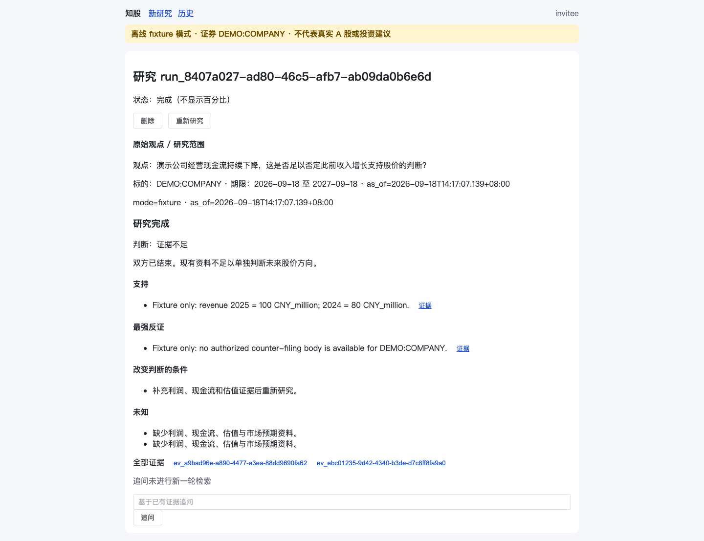
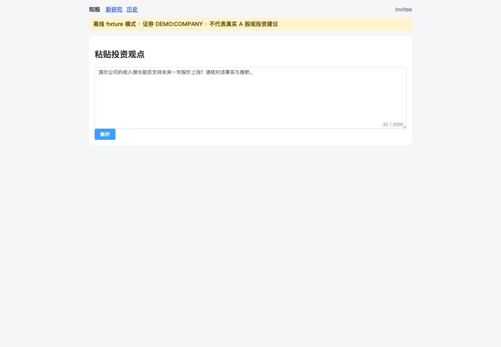
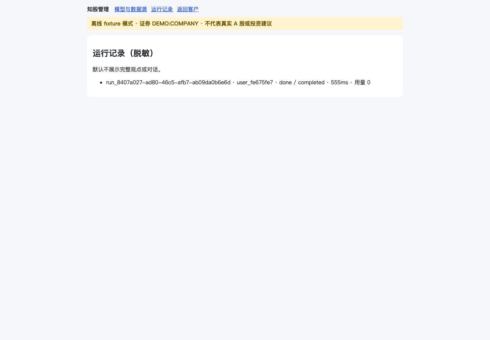
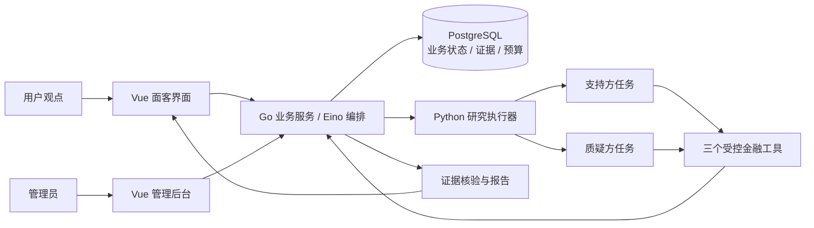

<div align="center">

# 知股 Zhigu

**让每一个投资观点，都经得起证据与反证。**

面向个人投资者的观点核验 Agent：拆解主张、双路研究、核对证据、生成可追溯报告。

[](https://github.com/AY-kkk/zhigu/actions/workflows/ci.yml)


[快速开始](#快速开始) · [产品界面](#产品界面) · [工作方式](#工作方式) · [路线图](ROADMAP.md) · [参与贡献](CONTRIBUTING.md)

</div>

> **当前版本：阶段 A 开发预览。** 使用虚构证券 `DEMO:COMPANY` 和 fixture 数据验证完整工程流程。真实金融数据、真实模型研究与生产部署尚未完成验收。源码公开不代表服务已可公开运营。

## 从一个观点开始

“收入增长是否足以支持这家公司未来一年的表现？”

知股把问题拆成可核验的主张，为支持方与质疑方创建独立研究任务，再汇总双方论证、原始证据与不确定性。无法得到足够证据时，保留“证据不足”，不把缺少反证写成观点已被证明。

1. **提出观点**：输入观点，确认证券、研究范围与时间窗口。
2. **双路研究**：支持方与质疑方分别获取财务信息、公告和计算结果。
3. **核对依据**：检查证据归属、时间、币种、期间、计算口径与引用。
4. **阅读报告**：查看结论、争议点和证据抽屉；围绕当前报告继续追问。

## 产品界面

以下为本地阶段 A 运行界面，截图中的账号与数据用于演示。

**研究报告：支持依据、反证与不确定性**



<details>
<summary>展开研究入口与管理后台</summary>

**面客研究入口**



**后台运行管理**



</details>

## 已经实现什么

| 能力 | 当前状态 |
| --- | --- |
| 登录、用户隔离、管理员路由 | 已实现，包含本地演示账号 |
| 观点解析、确认、排队、研究与报告 | fixture 全链路；模拟结果有明确标识 |
| 支持方 / 质疑方独立任务 | 已实现调度、上下文与证据隔离路径 |
| 财务查询、公告检索、确定性计算 | 三个受控工具；阶段 A 使用 fixture 数据 |
| 证据登记与引用追溯 | 保存证据身份、来源、时间与哈希，校验报告引用 |
| 预算、幂等、租约、取消与删除 | 已实现并有回归测试 |
| 管理后台 | 模型/数据源配置、策略管理、脱敏运行记录；模型“测试”当前只校验格式 |
| 真实模型、实时行情、真实投资结论 | **未完成，属于阶段 B/C** |

详细实现与验收边界见 [实现状态](app/IMPLEMENTATION_STATUS.md)。本项目不执行交易，也不提供收益承诺。

## 快速开始

需要 **Go 1.24.2+（1.24 系列）**、**Python 3.12 + uv**、**Node.js 22**、**PostgreSQL 16** 和 Git。首次安装依赖需要联网；运行 fixture 研究不需要模型或金融数据 API key。

```bash
git clone https://github.com/AY-kkk/zhigu.git
cd zhigu
cp app/.env.example app/.env
```

先准备 PostgreSQL，创建用户与数据库 `zhigu`。默认连接配置见 `app/.env`；Go 服务启动时会运行迁移并创建演示账号。

在三个终端中，从仓库根目录分别执行：

**1. Python 研究服务**

```bash
set -a
. ./app/.env
set +a
cd app/research-service
uv sync --frozen --no-dev
uv run --no-sync uvicorn app.main:app --host 127.0.0.1 --port 8091
```

**2. Go 业务服务**

```bash
set -a
. ./app/.env
set +a
cd app/server
go run .
```

**3. Web 界面**

```bash
cd app/web
npm ci
npm run dev -- --host 127.0.0.1
```

打开 [本地登录页](http://127.0.0.1:5173/login)。普通账号 `invitee`，管理员 `admin`，演示密码均为 `Passw0rd!`。所有演示凭据只用于本机验证。

可输入：“演示公司的收入增长能否支持未来一年股价上涨？请结合财务数据和反向证据核验。”

<details>
<summary>Docker Compose 开发配置</summary>

```bash
docker compose -f app/deploy/compose.yaml up --wait
```

该配置包含 PostgreSQL、Go、Python 和 Web，端口只绑定到本机。首次启动会下载依赖；数据库与任务数据使用 named volumes。启动前应确保 5432、8080、5173 端口空闲。此配置用于开发，不是生产部署模板；Docker 端到端运行情况见 [发布验证](docs/release-validation.md)。

</details>

## 工作方式



- **Go** 持有业务状态、权限、配置快照、预算与证据登记权；Eino 编排任务流程。
- **Python** 执行研究任务。工具限定为 `get_financials`、`search_filings`、`calculate_metric`，经 Go 授权和登记；阶段 A 明确使用 fixture 执行器。
- **PostgreSQL** 保存业务事实与证据；Python 的 SQLite 只保存执行器任务状态。
- **DeerFlow** 提供可选研究 Harness 适配。完整真实模型路径属于后续阶段；fixture 启动无需下载 Harness。可选依赖准备见 [开发指南](docs/development.md)。

## 项目结构

```text
app/
  server/              Go API、编排、预算、证据和数据库迁移
  research-service/    Python 执行器、工具与回归测试
  web/                 Vue 面客界面与后台
  contracts/           跨服务 JSON Schema
  deploy/              本地 Compose 配置
  tests/fixtures/      离线质量案例
docs/                  开发指南、截图、数据源与验证说明
handoff/               交付契约、示例和验收案例
references/            上游版本清单；不打包参考仓库源码
```

## 文档导航

| 我想了解 | 文档 |
| --- | --- |
| 产品范围与用户流程 | [MVP PRD](金融C端Agent_MVP_PRD.md) |
| 阶段 A 接口和验收 | [开发交付 SPEC](开发交付_SPEC.md) |
| 下一阶段真实数据与模型接入 | [阶段 B SPEC](阶段B_开发SPEC.md) |
| 本地开发、测试与可选 Harness | [开发指南](docs/development.md) |
| 免费 API 的用途与边界 | [数据源清单](docs/data-sources.md) |
| 当前实现和未完成项 | [实现状态](app/IMPLEMENTATION_STATUS.md) / [路线图](ROADMAP.md) |
| 首次公开发布验证 | [验证记录](docs/release-validation.md) |

## 参与贡献

欢迎提交可复现的问题、测试用例、文档改进和数据源适配方案。请先阅读 [贡献指南](CONTRIBUTING.md)，通过 [Issue 模板](https://github.com/AY-kkk/zhigu/issues/new/choose) 描述问题。涉及凭据、越权或数据泄露的问题，请使用 [安全报告通道](SECURITY.md)。

## 许可

原创代码的开源许可尚未指定，参见 [许可说明](LICENSE.md)。第三方依赖分别遵循各自许可证，详见 [第三方说明](THIRD_PARTY_NOTICES.md)。
