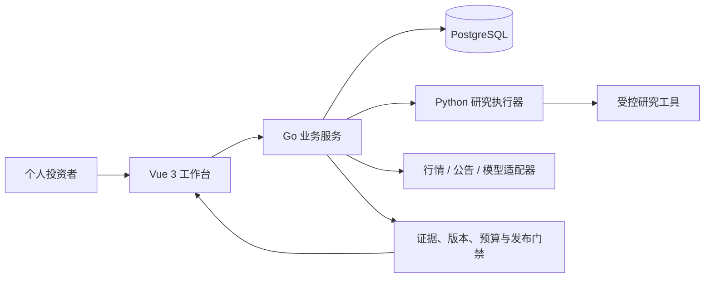

# GitHub README 三大核心模块介绍 Implementation Plan

> **For agentic workers:** REQUIRED SUB-SKILL: Use superpowers:subagent-driven-development (recommended) or superpowers:executing-plans to implement this plan task-by-task. Steps use checkbox (`- [ ]`) syntax for tracking.

**Goal:** Rewrite the repository root README around 投研观点、交易策略、事件追踪, attach the latest interaction video, and remove all legacy interface presentation.

**Architecture:** Replace only `README.md` with a single-page GitHub landing document. The page leads with the latest interaction video, then explains the three user modules, boundaries, architecture, setup, and documentation. No application code or contracts change.

**Tech Stack:** GitHub Markdown, HTML5 video fallback, Mermaid, Go, Python, Vue 3, PostgreSQL.

## Global Constraints

- Core module names are exactly `投研观点`, `交易策略`, `事件追踪`.
- The latest video path is `artifacts/intel/投资事件情报演示_60s.webm`.
- Remove the legacy `产品界面` section, old interface screenshots, and the old Stage A capability table from `README.md`.
- Do not modify `app/`, `contracts/`, `prd/`, `spec/`, or GitHub root compliance files.
- Distinguish shipped engineering, fixture/demo behavior, and unverified live behavior.
- Validate with `git diff --check`, link/path assertions, and `python3 scripts/check-public-tree.py`.

---

### Task 1: Rewrite the GitHub landing README

**Files:**
- Modify: `README.md`
- Reference: `docs/superpowers/specs/2026-09-26-github-readme-three-modules-design.md`

**Interfaces:**
- Consumes: the approved README information architecture and naming rules.
- Produces: the complete root README shown below.

- [ ] **Step 1: Replace `README.md` with the complete approved content**

Use exactly this content:

````markdown
<div align="center">

# 知股 Zhigu

**面向个人投资者的证据驱动投研工作台。**

把投资判断拆成可验证的问题，把策略构想变成可编辑、可回测的规则，把公司变化整理成可追溯的事件链。

[](https://github.com/AY-kkk/zhigu/actions/workflows/ci.yml)


[最近交互](#最近交互) · [三大核心模块](#三大核心模块) · [技术架构](#技术架构) · [快速开始](#快速开始) · [文档导航](#文档导航)

</div>

## 最近交互

以下视频展示当前工作台中的观点研究、策略配置与事件追踪交互：

<video controls preload="metadata" width="100%">
  <source src="./artifacts/intel/投资事件情报演示_60s.webm" type="video/webm">
  您的浏览器不支持视频播放。
</video>

[观看完整交互视频（60 秒）](./artifacts/intel/投资事件情报演示_60s.webm)

## 三大核心模块

### 1. 投研观点

**从一个观点开始，得到支持、反证、未知项和可追溯证据。**

- 输入投资观点，确认证券、研究范围与时间窗口。
- 将观点拆成可核验的主张，分别执行支持方与质疑方研究。
- 对财务数据、公告正文、计算口径、时间与引用进行交叉核验。
- 在报告中保留争议点、证据不足和未决问题，并支持继续追问。

边界：投研观点用于研究与核验，不执行交易，也不把缺少反证解释为观点已经成立。

### 2. 交易策略

**把策略构想变成可编辑规则，并查看确定性回测。**

- 通过自然语言和结构化规则创建策略，明确标的、仓位、买卖条件、止损与执行周期。
- 可视化编辑 AND / OR / NOT 条件组，支持连续天数、阈值和多指标组合。
- 保存、比较和复用策略版本；AI 只负责理解、建议、填充和解释。
- 查看成交、收益、回撤等回测结果，并从策略市场复制有来源的策略起点。

边界：指标、信号、交易语义、费用和回测由确定性服务计算；AI 不执行任意代码，策略市场内容不等于收益承诺。

### 3. 事件追踪

**关注公司变化，沿着事件与证据持续追踪。**

- 设置关注标的和事件范围，获得相关事件流。
- 查看事件主体、交易对手、事件类型、发生时间与来源覆盖。
- 沿证据时间线查看事实、最新变化、未决事项和历史版本。
- 对事件进行筛选、定位、回放与持续追踪。

边界：事件追踪负责发现变化和组织证据，不推断未披露的产业链关系，不直接给出买卖指令。

## 产品边界

- 本项目是研究与工程预览，不执行真实交易，不提供收益承诺或荐股服务。
- 代码中的 fixture、演示样本和真实数据能力分别标识；自动化测试通过不等于全部真实业务能力已经验收。
- 报告、策略与事件证据均保留来源、时间、口径、版本和不确定性，证据不足时明确拒答或降级。
- 真实模型、外部数据、费用控制和生产部署按对应验收矩阵逐步开放。

## 技术架构



- **Vue 3**：投研观点、交易策略、事件追踪以及管理入口。
- **Go**：身份权限、业务状态、策略 DSL、回测、证据登记、预算、版本与发布门禁。
- **Python**：执行受限研究任务，对接受控金融工具和研究 Harness。
- **PostgreSQL**：保存业务事实、策略版本、事件、证据和审计记录。
- **Contracts**：固定跨服务 Schema、策略 DSL、市场与事件接口边界。

## 快速开始

需要 Go 1.24.2+、Python 3.12 + uv、Node.js 22、PostgreSQL 16 和 Git。

```bash
git clone https://github.com/AY-kkk/zhigu.git
cd zhigu
cp app/.env.example app/.env
```

准备 PostgreSQL 并创建 `zhigu` 数据库，然后从仓库根目录分别启动：

```bash
# Python 研究执行器
cd app/research-service
uv sync --frozen --no-dev
uv run --no-sync uvicorn app.main:app --host 127.0.0.1 --port 8091
```

```bash
# Go 业务服务
cd app/server
go run .
```

```bash
# Web 工作台
cd app/web
npm ci
npm run dev -- --host 127.0.0.1
```

打开 `http://127.0.0.1:5173/login`。演示账号仅用于本机验证，不应进入生产环境。

## 项目结构

```text
app/
  server/              Go API、策略 DSL、回测、事件、证据与数据库迁移
  research-service/    Python 研究执行器、工具与回归测试
  web/                 Vue 投研观点、交易策略、事件追踪和后台
  contracts/           跨服务 JSON Schema 与 OpenAPI 契约
  scripts/             验证、manifest 与集成测试入口
contracts/             策略、市场和事件等冻结契约
prd/                   产品需求与用户流程
spec/                  开发规格、验收清单与开发指南
docs/                  发布验证与项目说明
artifacts/             交互演示和可复核验证产物
```

## 文档导航

| 我想了解 | 文档 |
| --- | --- |
| 投研观点产品范围 | [金融 C 端 Agent MVP PRD](prd/金融C端Agent_MVP_PRD.md) |
| 交易策略需求 | [策略模块 PRD](prd/策略模块_PRD.md) |
| 事件追踪需求 | [投资事件情报与证据时间线 PRD](prd/投资事件情报与证据时间线_PRD_严格研发测试评审_2026-09-25.md) |
| 策略开发契约 | [策略模块开发 SPEC](spec/策略模块_开发SPEC.md) |
| 事件追踪开发契约 | [投资事件情报与证据时间线开发 SPEC](spec/投资事件情报与证据时间线_开发SPEC.md) |
| 阶段 B 数据与模型边界 | [阶段 B 开发 SPEC](spec/阶段B_开发SPEC.md) |
| 本地开发与可选 Harness | [开发指南](spec/development.md) |
| 当前实现与验收边界 | [实现状态](app/IMPLEMENTATION_STATUS.md) / [发布验证](docs/release-validation.md) |

## 参与贡献

欢迎提交可复现的问题、测试用例、数据源适配和文档改进。请先阅读 [贡献指南](CONTRIBUTING.md)。涉及凭据、越权、证据伪造或数据泄露的问题，请使用 [安全报告通道](SECURITY.md)。

## 许可

原创代码的许可状态见 [许可说明](LICENSE.md)。第三方依赖分别遵循各自许可证，详见 [第三方说明](THIRD_PARTY_NOTICES.md)。

````

- [ ] **Step 2: Run content assertions**

Run:

```bash
python3 - <<'PY'
from pathlib import Path
text = Path('README.md').read_text(encoding='utf-8')
required = [
    '### 1. 投研观点',
    '### 2. 交易策略',
    '### 3. 事件追踪',
    'artifacts/intel/投资事件情报演示_60s.webm',
    '## 技术架构',
    '## 快速开始',
]
for value in required:
    assert value in text, value
for forbidden in ['## 产品界面', '阶段 A 离线演示', '<img']:
    assert forbidden not in text, forbidden
assert text.count('<video') == 1
assert text.count('观看完整交互视频') == 1
print('README content checks passed')
PY
```

Expected: `README content checks passed`.

- [ ] **Step 3: Validate whitespace and repository links**

Run:

```bash
git diff --check
python3 - <<'PY'
from pathlib import Path
text = Path('README.md').read_text(encoding='utf-8')
for rel in [
    'artifacts/intel/投资事件情报演示_60s.webm',
    'prd/金融C端Agent_MVP_PRD.md',
    'prd/策略模块_PRD.md',
    'prd/投资事件情报与证据时间线_PRD_严格研发测试评审_2026-09-25.md',
    'spec/策略模块_开发SPEC.md',
    'spec/投资事件情报与证据时间线_开发SPEC.md',
    'spec/阶段B_开发SPEC.md',
    'spec/development.md',
    'app/IMPLEMENTATION_STATUS.md',
    'docs/release-validation.md',
]:
    assert Path(rel).exists(), rel
print('README link targets exist')
PY
```

Expected: no `git diff --check` output and `README link targets exist`.

- [ ] **Step 4: Commit the README update**

```bash
git add README.md
git commit -m "docs: 重构 GitHub 三模块项目介绍"
```

### Task 2: Run public release validation

**Files:**
- Validate: `README.md`
- Validate: all tracked public files

**Interfaces:**
- Consumes: the committed README from Task 1.
- Produces: a verified public tree ready to merge into `main`.

- [ ] **Step 1: Run the public tree checker against the committed tree**

The current workspace contains unrelated local deletions, so run the checker in a clean tree built from `HEAD`:

```bash
tree=$(git rev-parse HEAD)
tmp=$(mktemp -d /tmp/zhigu-readme-public.XXXXXX)
git archive "$tree" | tar -x -C "$tmp"
git -C "$tmp" init -q
git -C "$tmp" add -A
python3 "$tmp/scripts/check-public-tree.py"
```

Expected: `Public tree checked: ... tracked files` and exit code 0. Keep the temporary directory for traceability; do not delete unrelated workspace files.

- [ ] **Step 2: Review the final README diff**

Run:

```bash
git show --stat --oneline HEAD
git show --format= -- README.md | sed -n '1,260p'
```

Expected: the commit contains only `README.md`; the diff adds three modules and the current video while removing legacy interface presentation.

- [ ] **Step 3: Push the feature branch**

```bash
git push origin feat/zhigu-editorial-frontend
```

Expected: the branch updates successfully.
