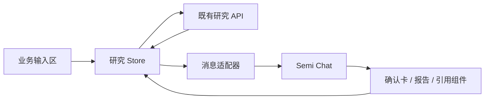

# 知股前端改版设计要求：浅红极简投研工作台

版本：v1.1 · 日期：2026-09-19 · 交付类型：设计要求与开发交接文档

v1.1 增补：依据用户指定的 Semi Vue 开源仓库，明确组件与示例复用、源码位置、主题接入、业务扩展点和迁移验收。第 9.4–9.9 节为开发落地要求；本版以 Semi Vue 作为面客 UI 组件基础，替代 v1.0 中仅用 Element Plus 模仿外观的默认建议。

**设计目标：左侧固定三个功能入口，右侧以投研对话为核心；大面积白色、浅灰与淡红色表面，少量柔和红色强调操作，形成安静、清晰、适合长时间阅读的投研工作台。**

本文定义待实现的界面，不代表前端已经改版或相关接口已经补齐。基于本地代码 `7c99f64` 进行现状核对，范围为面客前端；管理后台保持独立。

## 1. 已确定要求与设计默认值

### 1.1 用户明确要求

- 参考提供的投研平台截图，采用左侧交互导航、右侧主要对话台的布局。
- 左侧业务入口暂时只有「个人界面」「投研观点」「交易策略」，保留这三个名称。
- 使用不太深的红色，整体高级、极简。
- 参考 [Semi UI Vue](https://semi-ui-vue.netlify.app/) 的前端设计语言。
- 基于 [Semi Vue 开源代码](https://github.com/rashagu/semi-design-vue)，在本文中明确可以复用和需要改造的前端代码。
- 本次以 Markdown 文档交付设计要求。

### 1.2 本文采用的设计默认值

以下是建议方案，不视为用户已经逐项确认的功能要求：

- 默认进入「投研观点」；桌面左栏为 88px 窄导航，图标在上、文字在下。
- 「个人界面」展示当前账户及研究记录；「投研观点」承接完整研究对话；「交易策略」本期显示预留说明页。
- 右侧主对话台属于「投研观点」，切换到个人或策略入口时，右侧切换为对应工作区。
- 浅红氛围主要来自选中底色和少量强调色，不把整页铺成粉红，也不使用暗红主题。
- 保留现有 Vue 3、Vite、Vue Router 和 Pinia 应用宿主，面客组件改用 Semi Vue；后台暂保留 Element Plus。优先复用发布包与布局示例，在应用层封装知股业务组件，不直接改写上游组件库。

三个入口共用同一页面外壳。若后续决定让三个入口都采用对话形式，可复用本规范的侧栏、顶栏、消息与输入组件；个人和策略的业务流程需另补设计。

## 2. 参考依据与取舍

### 2.1 从用户截图中借鉴什么

截图可观察到：全高窄侧栏、浅色背景、轻量顶部会话标题、用户内容靠右、助手内容靠左、底部输入区域。借鉴其「导航退后、内容居前」的关系。

需要调整：

- 仅保留三个业务入口，不复制截图中的搜索、直播、日历、更多等菜单。
- 对话正文与输入框统一限宽，避免超宽屏时两侧消息距离过远。
- 内容操作紧跟对应答案，避免复制、来源等操作散落到屏幕另一端。
- 不复用截图中的品牌、充值提示和产品文案。
- 截图仅用于静态布局参考，不能据此认定原站的折叠、滚动、动效和发送机制。

### 2.2 Semi 参考范围

本次实际查看了 Semi UI Vue 的快速开始页面：白底、浅灰内容容器、细分隔线、清晰文字层级，以及左侧导航与正文分区。借鉴这些视觉处理，不复制组件文档站的多层菜单和右侧目录。参考：[快速开始页面](https://semi-ui-vue.netlify.app/zh-CN/start/getting-started/)。

对应 GitHub 项目是 [rashagu/semi-design-vue](https://github.com/rashagu/semi-design-vue)，其说明为基于 Semi Design 的 Vue 3 适配，安装包为 `@kousum/semi-ui-vue`。它与 [Semi Design 官方站](https://semi.design/zh-CN/) 应分别标注；不能把 Vue 适配项目直接写作官方 Vue 产品，也不能把官网列出的能力当成本仓库已集成的能力。

本文全部尺寸、红色色值、圆角与动效数值均为新方案定义，不是对参考站或截图的精确取样。

### 2.3 布局方案比较

| 方案 | 特点 | 取舍 |
|---|---|---|
| **88px 窄导航 + 单工作区，采用** | 接近参考图，三个入口始终可见，对话空间充足 | 历史记录需从顶栏或个人界面进入 |
| 208px 展开侧栏 + 单工作区 | 适合长期展示历史会话与分组 | 当前只有三个入口，容易显得空且占空间 |
| 导航 + 会话列表 + 对话三栏 | 高频切换大量研究时效率高 | 当前首期复杂度过高，压缩正文，不作为默认 |

## 3. 现有页面与改版关系

现状来自源码阅读，本次没有运行应用或进行现有页面的浏览器验收。

| 已核对的现状 | 改版要求 |
|---|---|
| 面客布局为最大宽 960px 的居中容器，顶部「新研究／历史」 | 改为全视口侧栏与右侧工作区，仅正文阅读列限宽 |
| 新研究页为大文本框、解析按钮、证券与期限表单 | 收敛为底部输入区与对话内确认卡，保留人工确认步骤 |
| 详情页先显示研究 ID，再堆叠按钮、报告和追问输入 | 显示可读研究标题；报告嵌入消息流；次要操作收入菜单 |
| 报告与历史直接出现 `mode`、`as_of`、英文状态、运行 ID | 面客文案转为中文；数据截止时间与样本标识继续显式展示 |
| 证据抽屉已包含来源、定位、时间、版本和指标 | 保留信息完整性，改善分组和排版 |
| 依赖为 Vue 3、Vue Router、Pinia、Element Plus | 保留宿主、路由与状态管理；面客迁移到 Semi Vue，后台暂保留 Element Plus，验证两套样式共存与浮层主题隔离 |

对应源码：[面客布局](../../../app/web/src/layout/consumer/index.vue)、[新研究页](../../../app/web/src/view/research/new.vue)、[详情页](../../../app/web/src/view/research/detail.vue)、[历史页](../../../app/web/src/view/research/history.vue)、[依赖清单](../../../app/web/package.json)。

## 4. 页面结构与导航

### 4.1 桌面骨架

```text
┌─────────┬────────────────────────────────────────────────────┐
│  知股   │ 投研观点 / 当前研究标题             历史记录  新研究 │
│         ├────────────────────────────────────────────────────┤
│  个人   │ 样本环境说明（仅在对应环境展示）                     │
│  界面   │                                                    │
│         │             主阅读列，最大宽 840px                  │
│  投研   │                         用户提交的投资观点           │
│  观点 ● │             研究范围确认卡                         │
│         │             真实研究阶段                           │
│  交易   │             助手报告：判断、支持、反证、未知         │
│  策略   │             来源 [1] [2] · 复制                     │
│         │                                                    │
│         ├────────────────────────────────────────────────────┤
│         │             输入观点 / 基于报告追问                 │
│         │             字数与范围说明               发送操作  │
└─────────┴────────────────────────────────────────────────────┘
```

示意中的标签可为绘图换行，真实桌面导航文字使用完整单行「个人界面」「投研观点」「交易策略」。证据抽屉只在点击引用后从右侧出现，不形成常驻第三栏。

### 4.2 尺寸与滚动

| 区域 | 规范 |
|---|---|
| 页面外壳 | 填满可用视口，以 `100dvh` 处理动态高度；支持 `100vh` 回退 |
| 左侧导航 | 桌面固定 88px，全高，右侧 1px 分隔线 |
| 品牌区域 | 高 64px，只保留简洁标识与「知股」；不新增复杂 Logo 设计任务 |
| 导航项 | 64 × 64px，居中；20px 线性图标，12px 标签，间距 6px；项间距 8px |
| 主区顶栏 | 高 64px，左右内边距 32px，底部分隔线；标题 16px |
| 消息与输入阅读列 | 最大宽 840px，在右侧工作区内水平居中；不得相对整个屏幕居中 |
| 正文外边距 | 桌面最少 32px；窄屏 16px |
| 消息间距 | 不同轮次 24–32px；同一回复中的分组 16–24px |
| 输入容器 | 与阅读列同宽；初始约 112px，随文字增加，整体最大高 220px |
| 证据抽屉 | 桌面宽 480px；小屏为全屏面板；正文可换行 |

右侧工作区纵向分为顶栏、环境提示、可滚动消息区、输入区。消息区使用剩余高度，输入区在正常布局中占位，不能用覆盖正文的绝对定位。页面不出现主区与整页互相争抢的双重纵向滚动。

用户停留在消息底部时，新内容可滚动进入视野；正在阅读上文时不强制拉回，显示「回到最新」按钮。导航不随消息滚动。

### 4.3 三个入口

| 入口 | 右侧内容 | 主要动作与状态 |
|---|---|---|
| 个人界面 | 账户简要信息、我的研究记录 | 打开研究、加载更多、退出登录 |
| 投研观点 | 首次欢迎态、观点确认、研究状态、报告和追问 | 新建研究、人工确认、查看证据、取消、重新研究 |
| 交易策略 | 简洁预留页 | 标题「交易策略」；说明「策略研究功能正在规划中」；按钮「前往投研观点」 |

「交易策略」必须可点击并落到完整说明页，不出现无响应菜单。当前不设计假的收益曲线、策略胜率、回测结果、持仓或下单按钮。

「个人界面」使用现有账户信息，不新增风险测评、资产绑定、付费中心、长期偏好记忆等业务。

### 4.4 路由与选择状态

| 路由 | 导航选中项 | 处理 |
|---|---|---|
| `/app/research/new` | 投研观点 | 保留现有地址，默认入口 |
| `/app/research/:id` | 投研观点 | 保留现有地址，打开具体研究 |
| `/app/profile` | 个人界面 | 建议新增账户与历史页面 |
| `/app/history` | 个人界面 | 兼容旧链接，跳转至 `/app/profile?tab=history` |
| `/app/strategies` | 交易策略 | 建议新增预留说明页 |

顶栏「历史记录」打开临时历史抽屉，保留当前对话上下文；「查看全部」进入个人界面的完整历史列表。抽屉与完整列表复用同一数据与样式，不新增常驻历史栏。历史抽屉和证据抽屉不同时展开。

首次登录默认「投研观点」。同一登录会话内，切换侧栏应保留正在编辑的草稿与当前研究位置；退出登录时清除前端内存中的私人草稿。刷新后的恢复边界见第 9 节。

## 5. 浅红极简视觉系统

### 5.1 色彩

设计原则：白与中性色占绝大部分画面；红色集中于选中导航、主要操作和少量状态强调。通过淡红底色获得轻盈感，通过较实的红色保障小字与按钮的可读性。

| Token | 色值 | 使用范围 |
|---|---|---|
| `canvas` | `#FCFBFB` | 页面基础画布 |
| `surface` | `#FFFFFF` | 主工作区、输入框、抽屉 |
| `sidebar` | `#F7F5F5` | 左侧导航背景 |
| `surface-muted` | `#F6F4F4` | 用户气泡、次级容器 |
| `brand-primary` | `#B94C55` | 主要按钮、白底链接、选中图标 |
| `brand-hover` | `#AB424C` | 主按钮悬停 |
| `brand-active` | `#9C3943` | 主按钮按下 |
| `brand-soft` | `#FBEDEF` | 选中导航背景、少量弱强调 |
| `brand-soft-hover` | `#FFF5F5` | 导航悬停浅底 |
| `brand-text` | `#A33F48` | 淡红背景上的文字 |
| `text-primary` | `#272326` | 标题、正文、重要数值 |
| `text-secondary` | `#716B70` | 辅助说明、时间、次级操作 |
| `border-subtle` | `#ECE7E8` | 容器分隔、卡片边框 |
| `control-border` | `#91858A` | 输入控件边界；不用于整页分隔 |
| `danger` | `#C7373F` | 错误、删除确认，独立于品牌色 |
| `success` | `#237A57` | 成功反馈，小面积使用 |
| `warning` | `#8A6500` | 数据缺口、环境提示；配浅黄底 `#FFF8E6` |

主按钮白字配 `#B94C55` 的理论对比度约 4.97:1；次级文字 `#716B70` 在白底约 5.20:1。品牌主色直接作为淡红底小字时对比度不足 4.5:1，因此使用较深的 `brand-text`。这些是色值计算结果，不能替代最终渲染和交互检查。

禁止整页红色渐变、暗红侧栏、霓虹边缘、大面积粉色卡片、常驻红色输入框描边。行情涨跌色与品牌、成功、错误分别定义；未来若加入行情，数值必须同时包含正负号或涨跌文字。

### 5.2 字体与层级

字体栈：`-apple-system, BlinkMacSystemFont, "Segoe UI", "PingFang SC", "Hiragino Sans GB", "Microsoft YaHei", sans-serif`。优先系统字体，不为首版加载装饰字体。

| 用途 | 字号 / 行高 | 字重 |
|---|---|---|
| 欢迎标题 | 28 / 38px | 600 |
| 页面标题 | 20 / 30px | 600 |
| 顶栏标题、报告小标题 | 16 / 24px | 500–600 |
| 对话正文 | 16 / 28px | 400 |
| 普通控件、卡片说明 | 14 / 22px | 400–500 |
| 导航标签、时间、辅助信息 | 12 / 18px | 400–500 |

长报告按语义分段，避免整段加粗。数字与单位不拆散；适用时使用等宽数字。不得以极浅灰替代辅助信息的清晰层级。

### 5.3 间距、圆角与阴影

- 间距采用 `4 / 8 / 12 / 16 / 24 / 32 / 48px`；同类组件统一。
- 按钮、下拉框圆角 8px；导航选中面、卡片、输入框圆角 12px。
- 常规按钮高 36px，核心提交按钮高 40px；移动端操作热区至少 44 × 44px。
- 默认无阴影。输入区或浮层必要时使用 `0 4px 16px rgba(39,35,38,0.04)`；抽屉阴影可略强。
- 线性图标统一 20px、相近线宽；不混用彩色 Emoji、实心与描边图标。
- 颜色和透明度过渡 150ms，抽屉过渡 200ms；尊重减少动态效果设置，不做装饰性循环动画。

## 6. 主要页面与对话流程

### 6.1 首次进入：让用户立即知道输入什么

顶栏显示「投研观点」，右侧为「历史记录」和「新研究」。无会话时「新研究」可隐藏，避免重复动作。

欢迎区域位于右侧工作区上半部，保持适当留白：

> **让投资观点，经得起验证**  
> 粘贴一段观点，一起查看它的依据、反证与未知。

下方最多三个轻量文字按钮：「核对事实依据」「寻找关键反证」「检查推理假设」。点击只填入可编辑的示例，不立即发请求。示例使用明确标注的演示公司，不预填未经核实的真实公司数据。

底部输入提示：「粘贴一个关于单家公司的投资观点，20–2,000 字」。默认正文为空；现有演示文本改为用户主动选择的示例。

### 6.2 观点输入与人工确认

1. 用户输入后点击「解析观点」。首轮操作不用模糊的「发送」掩盖下一步行为。
2. 原始观点以浅灰用户气泡出现，靠右，最大宽为阅读列的 80%；长内容允许展开全文。
3. 助手在同一消息流显示「确认研究范围」卡片，包括证券候选、研究期限、数据截止时间、1–6 条拆解主张。
4. 用户点击「确认并开始研究」后才创建研究任务；未选择有效证券或期限时明确指出缺项。
5. 主张不准确时，通过「修改原观点」返回编辑并重新解析；不得在后端未支持时假装主张编辑已保存。
6. 原文一旦变化，旧确认卡立即失效。重新解析之前禁止按旧草稿开始研究。

确认卡为白底细边框、内边距 20px，不弹出遮挡页面的多步大表单。用户提交后的字段与研究范围冻结，后续更改进入新研究。

输入计数与后端口径一致；超长粘贴保留提示，不静默截断后直接发送。空白输入不启用操作。解析失败保留原文并提供重试。

### 6.3 研究运行中

在确认卡后插入一条紧凑的状态消息，使用实际后端阶段：排队、调查、核对、完成。状态只展示已经发生或当前正在执行的阶段，不预演模型行动。

- 不显示猜测进度百分比、伪造工具日志或模拟逐字报告。
- 输入区暂时锁定本研究的发送动作，说明「正在研究，完成后可基于证据追问」。
- 提供「取消研究」；点击后显示「取消中」，以后端确认结果为准。
- 用户可打开历史与个人页面；回到当前研究继续显示真实状态。
- 后端限制同一用户存在活动研究时，新研究页应提示「已有研究进行中」并提供返回入口，不能假装支持并行研究。

### 6.4 报告完成：以阅读为主

助手回复左对齐，占据阅读列。长报告采用直接排版，不整体包在厚重气泡或多层卡片中。

信息顺序：

1. 原始观点与研究范围：公司、期限、数据截止时间。
2. 判断标签：得到支持／受到挑战／证据混合／证据不足。
3. 简洁摘要：先说明核心判断，再说明成立条件。
4. 支持证据。
5. 最强反证。
6. 改变判断的条件。
7. 未知项与证据缺口。
8. 来源汇总。

支持和反证使用纵向分区，视觉权重相当；不使用左右对战卡片、获胜标识或未经校准的分数。未知项不能默认折叠藏起。

引用以紧邻对应陈述的 `[1]`、`[2]` 按钮展示。悬停可提示来源标题，点击打开证据抽屉。数字由当前报告的证据映射产生，不得用展示顺序冒充真实证据关系。

报告下方保留「复制报告」和「重新研究」，复制时保留来源、数据截止时间与必要限制。删除归入更多菜单，并在操作时说明删除范围。

### 6.5 追问

有可用已发布报告时，底部输入区切换为「基于这份报告追问」，按钮为「发送追问」。用户问题与助手回答追加到当前消息流。

- 持续显示简短说明：「仅使用本报告证据，不进行新检索」。
- 每份报告最多 3 轮；无服务端计数时仅显示固定上限，不猜剩余次数。
- 超限时停用发送，说明已达到上限，提供「重新研究」入口。
- 需要新事实时明确提示重新研究；点击后进入新的范围确认过程，不自动覆盖旧报告。
- 无完整报告或权限不足时，不展示看似可用的追问输入。
- 追问答案中的证据引用和限制需展示，不能只渲染 `answer` 文本而丢弃来源。

### 6.6 证据抽屉

抽屉标题「证据详情」，内容按以下顺序分组：

| 分组 | 内容 |
|---|---|
| 来源 | 标题、来源名称、外部原文链接 |
| 定位 | 文档页码、章节或原文定位信息 |
| 原文 | 支持该陈述的原文片段；允许复制 |
| 时间 | 披露时间、可获得时间、获取时间；不合并成含糊的「更新时间」 |
| 指标 | 数值、单位、币种（若有）、报告期、数值类型、可用计算依据 |
| 数据记录 | 版本、真实／离线样本标识 |

缺失字段显示「暂未提供」或对应解释，不补造数字或日期。保留现有外链安全处理。打开后焦点进入抽屉；Esc 关闭，焦点返回引用按钮。窄屏不出现横向溢出。

### 6.7 个人界面与历史记录

顶部为「个人界面」标题、账户名与退出登录入口，下方为「我的研究」。采用单列研究记录，不做资产仪表盘。

每条记录优先显示可读公司名称或标识、创建时间、状态、样本标记和「打开研究」。已有完整标题时可展示；接口未返回时使用「公司标识 · 观点研究」，不以运行 ID 为主标题，不为每一行额外请求详情拼标题。

使用现有游标加载更多。不在只加载部分数据时显示「全部记录共 N 条」或提供误导性的全局搜索。空态为「还没有研究记录」，按钮「开始第一条研究」。

## 7. 组件状态与文案

| 组件 / 状态 | 外观与行为 |
|---|---|
| 导航默认 | 灰色图标与文字，无大面积边框 |
| 导航悬停 | 很淡红底；保持文字清晰 |
| 导航选中 | 淡红底、深一档红字、字重 500；具有 `aria-current` |
| 主按钮 | 柔和红底白字；hover 加深；提交时有明确忙碌状态 |
| 次按钮 | 白底或透明底，灰色文字与细边框 |
| 输入聚焦 | 红色焦点边界与浅外环；键盘焦点不能只靠阴影识别 |
| 输入禁用 | 中性浅底，说明禁用原因；不靠透明度使文字难以辨认 |
| 加载中 | 轻量骨架或文字状态；不同时放多种加载动画 |
| 操作失败 | 在相关组件附近解释原因，保留输入并提供可执行的下一步 |

面客文案替换：

| 开发字段或旧文案 | 面客表达 |
|---|---|
| `mode=fixture` | 离线样本 |
| `mode=live` | 真实数据模式；不据此声称当前已连接所有上游 |
| `as_of` | 数据截止时间 |
| `run_id` | 默认隐藏；「研究详情」中作为研究编号，便于排查 |
| `queued / researching / verifying` | 排队中／调查中／核对中 |
| 「状态：调查（不显示百分比）」 | 「正在调查相关证据」 |
| `incomplete` | 研究未完成，并解释已完成与缺失部分 |
| `CONFIG_NOT_READY` | 研究服务暂未配置完成，请稍后再试 |

样本模式提示建议：「当前为离线样本演示，内容不代表实时市场数据。」与实际环境相符时才显示；现有样本标识不能因极简化而被删去或缩成难以注意的小点。

## 8. 异常、响应式与可访问性

### 8.1 必须设计的异常状态

| 情况 | 用户看到什么 | 可用动作 |
|---|---|---|
| 解析失败／不在证券覆盖范围 | 解释失败或范围限制，保留原文 | 修改观点、重试解析 |
| 网络中断 | 「连接已中断，研究状态可能仍在更新」 | 重试获取；不自动再建研究 |
| 研究未完成 | 明确未完成，只显示后端已允许发布的内容，不给完整结论 | 查看可用证据、重新研究 |
| 研究失败 | 简短原因，不展示内部堆栈 | 重新研究 |
| 证据不足 | 显示「证据不足」及具体缺口 | 查看已有证据；不能伪造倾向结论 |
| 取消中／已取消 | 分开显示两个状态 | 等待确认／开始新研究 |
| 追问超限 | 显示固定上限及已达上限状态 | 重新研究 |
| 无权限／记录不存在 | 统一「该研究无法访问」 | 返回我的研究 |
| 证据加载失败 | 抽屉内说明，不清空主报告 | 重试加载 |

### 8.2 响应式

| 视口宽度 | 布局规则 |
|---|---|
| ≥ 1200px | 88px 左栏，64px 顶栏，840px 最大阅读列，主区边距至少 32px |
| 768–1199px | 保留 88px 左栏，正文外边距 24px；输入区随主区缩放 |
| < 768px | 左栏改为顶部菜单按钮打开的导航抽屉；主区边距 16px，顶栏 56px，证据与历史面板全屏 |

移动端导航抽屉仍只有三个入口，选中后关闭。不开底部常驻导航，避免与输入区和软键盘争夺空间。输入与报告共用可用视口，适配底部安全区；短屏时输入区增长上限不超过可用高度的 35%。长 URL、长公司名、长引用文本必须换行。

设计核对尺寸：1440 × 900、1280 × 800、768 × 1024、390 × 844；另用 320px 宽检查基本可用性，用 200% 缩放检查重排。

### 8.3 可访问性

- 普通文本对比度至少 4.5:1；必要控件边界与状态标识至少 3:1。
- 所有操作可键盘访问，焦点清晰；图标按钮有可读标签，hover 提示不能是唯一说明。
- 桌面输入区 Enter 换行，Cmd/Ctrl + Enter 提交；中文输入法组合期间不得误提交。移动端依靠显式发送按钮。
- 加载、失败和完成状态使用适当的状态播报，避免每次轮询重复打断读屏。
- 不仅用颜色表达选中、风险、错误、支持或反证；配合文字与形状。
- 删除研究需明确确认对象；取消、删除、重新研究是三个独立动作。

## 9. 开发交接与能力边界

### 9.1 保留的业务流程

本规范调整面客呈现，不改变「观点输入 → 解析 → 人工确认 → 研究 → 发布报告 → 基于证据追问」闭环。业务依据见 [一期 PRD](../../../金融C端Agent_MVP_PRD.md) 与 [阶段 B SPEC](../../../阶段B_开发SPEC.md)。

保留既有鉴权、草稿版本校验、幂等创建、取消状态、引用绑定和已发布报告限制。模型供应商、API Key、Chat Completions／Responses 协议选择继续由管理后台负责，不增加到面客输入框。

### 9.2 建议组件划分

以下名称是开发拆分建议，不表示文件已经存在。

| 组件 | 责任 | 对应已有位置 |
|---|---|---|
| `ConsumerShell` / `SideNav` | 页面骨架、三个入口、移动导航 | `layout/consumer/index.vue` |
| `WorkspaceHeader` | 标题、历史、新研究与更多操作 | 从新研究及详情页提取 |
| `ConversationView` / `MessageItem` | 消息排列、滚动、回到最新 | `view/research/new.vue`、`detail.vue` |
| `ResearchComposer` | 首轮输入、字数、追问、忙碌状态 | `components/research/ClaimEditor.vue` |
| `ResearchConfirmCard` | 证券、期限、主张、确认和失效提示 | 从 `new.vue` 提取 |
| `ResearchStatus` | 服务端阶段与取消状态 | 从 `detail.vue` 提取 |
| `ReportMessage` | 结构化报告与来源引用 | `components/research/Report.vue` |
| `EvidenceDrawer` | 证据详情与焦点恢复 | 复用同名组件 |
| `ResearchHistoryList` | 个人页和历史抽屉共享的列表 | `view/research/history.vue` |
| `ProfilePage` / `StrategyPage` | 账户历史与策略预留页 | 新增页面 |

主题 Token 在面客根节点与专用浮层容器上统一定义，并映射到 Semi CSS 变量。后台保留原 Element Plus 主题；具体变量和迁移要求见第 9.7–9.9 节。

### 9.3 当前接口能支持什么，缺什么

依据当前 [前端 API](../../../app/web/src/api/research.js)、[研究服务](../../../app/server/service/finance/research_service.go) 和 [追问服务](../../../app/server/service/finance/questions.go) 阅读结果：

| 需求 | 当前可见接口情况 | 本期呈现规则 |
|---|---|---|
| 解析、创建、状态、报告、取消、删除、证据与追问 | 存在对应请求入口 | 沿用既有业务接口 |
| 刷新后恢复研究与报告 | 详情接口返回研究、原观点和报告 | 从服务端重新加载，不能重新提交 |
| 历史可读标题 | 历史列表返回证券 ID、状态、时间等，未返回观点标题 | 使用证券标识与通用标题；完整标题需接口补充 |
| 追问消息跨刷新恢复 | 当前详情响应未返回追问列表 | 本期会话内内存保留；刷新不承诺完整追问回放，并在追问区简短说明 |
| 剩余追问次数 | 当前追问响应未返回已用或剩余计数 | 显示「每份报告最多 3 轮」，服务端超限后禁用；不展示猜测数字 |
| 草稿跨刷新恢复 | 当前前端未实现 | 本期只要求同一会话导航切换保留，不默认将私人观点持久写入浏览器存储 |
| 交易策略、回测与收益 | 未发现本次所需业务入口 | 只交付预留说明页 |

如需要完整聊天历史、服务端剩余次数或策略功能，须作为独立接口增量补齐和验收，不用静态数据填充成功状态。

### 9.4 Semi 源码基线与“脚手架”的实际范围

**实施结论：以现有 `app/web` 为应用脚手架，接入 Semi Vue 发布包；以其 `LeftNavSide.vue` 布局示例为页面骨架，使用 Chat 扩展点组装知股业务。**

用户指定的仓库主要提供组件库、组件示例、Storybook 和 VitePress 文档站。其根目录 `dev` 进入组件包，`build:lib` 构建多个库包；它不是已经包含知股路由、登录、研究 Store 和业务接口的完整产品脚手架。不要把整个上游 monorepo 覆盖到现有应用。[源码：根 package.json][semi-root]

本次取证范围：

| 项目 | 已核实值与证据边界 |
|---|---|
| 上游仓库 | `rashagu/semi-design-vue`，默认分支 `master` |
| 固定源码提交 | `15074390002324fd1fe9467d61b4a5dc93a475f5`；以下源码链接均固定到该提交 |
| UI 包 | `@kousum/semi-ui-vue@2.78.4`；源码声明与 npm 该版本元数据均已读取 |
| 图标包 | `@kousum/semi-icons-vue@2.78.0`；npm 该版本元数据已读取 |
| 基础依赖 | 上述 UI 发布包依赖 `@douyinfe/semi-foundation@2.78.0`、`@douyinfe/semi-theme-default@2.78.0` |
| 可选主题插件 | `@kousum/vite-plugin-semi-theme@2.78.0`；其 peer 声明 Vite `^6.0.0`，与当前项目声明的大版本一致 |
| 已做验证 | 源码阅读、导出/接口/示例核对、指定 npm 版本及部分发布包内容读取 |
| 未做验证 | 未安装到知股、未运行该库构建、未做两库混用和浏览器兼容实测；版本存在不等于集成已通过 |

上述为本次审查的候选锁定版本，不宣称是未来实施时的最新版。实施时使用精确版本并提交实际锁文件，不只写 `latest` 或直接依赖上游分支。参考：[UI 包源码][semi-package]、[UI 发布版本元数据](https://registry.npmjs.org/@kousum%2Fsemi-ui-vue/2.78.4)、[图标版本元数据](https://registry.npmjs.org/@kousum%2Fsemi-icons-vue/2.78.0)。

复用层级约定：

1. **直接依赖组件包**：Layout、Nav、Button、TextArea、Select、Chat、SideSheet 等通过公开导出使用。
2. **改造示例组合**：参考 `LeftNavSide.vue` 的布局组合及 Chat 示例的参数组织，改成自己的 `.vue` 业务组件。
3. **应用层新增**：范围确认、报告语义、引用绑定、状态轮询、权限、草稿、幂等与路由仍由知股实现。
4. **不默认 fork 组件库**：只有公开扩展点无法满足且问题经复现后，才记录必要补丁、上游 SHA 与回归测试；不直接编辑 `node_modules`。

上游 [LICENSE][semi-license] 为 MIT，复用实质源码或示例时保留其版权和许可说明，并在本项目 `THIRD_PARTY_NOTICES.md` 记录来源、固定提交与改造范围。示例中的 Semi／ByteDance Logo、版权页脚和外部演示地址不作为知股产品素材使用。

### 9.5 组件与示例复用清单

下表中目录均指上游仓库，目标文件相对本项目 `app/web/src/`。目标文件尚未实现。

| 需求编号 | 可复用源码 / 示例 | 知股具体改造要求 | 目标位置 |
|---|---|---|---|
| SEMI-01 页面骨架 | [LeftNavSide.vue][semi-layout-demo]；`layout/index.tsx` 的 `Layout`、`LayoutSider`、`LayoutHeader`、`LayoutContent` | 删去示例面包屑、全站页脚、铃铛及帮助菜单；侧栏改 88px、顶栏 64px，内容改消息滚动区与输入区；移除演示固定内容高度 | `layout/consumer/index.vue` |
| SEMI-02 三入口导航 | [navigation/index.tsx][semi-nav] 的 `Nav`；[Item.tsx][semi-nav-item] 的 `NavItem` | 仅建立 profile/research/strategies 三个稳定 key，`selectedKeys` 从当前路由计算，`onSelect` 映射 Vue Router；改成图标在上、完整文字在下；不要用 `isCollapsed=true` 实现本稿的窄导航 | `components/workspace/SideNav.vue` |
| SEMI-03 顶栏 | 布局示例中的 `Button`、`Avatar`，公开导出的 `Dropdown`、`Tooltip` | 标题、历史、新研究及更多操作分组；新研究按钮按页面状态出现；不显示默认演示头像和账号 | `components/workspace/WorkspaceHeader.vue` |
| SEMI-04 对话消息 | [chat/index.tsx][semi-chat]、[interface.ts][semi-chat-interface]、[ChatDemo.tsx][semi-chat-demo] | 受控 `chats`，`mode="userBubble"`、`align="leftRight"`；替换默认角色名/头像；使用自定义内容渲染承接确认卡、状态和报告 | `components/research/ResearchChatPane.vue` |
| SEMI-05 输入区 | [input/textArea.tsx][semi-textarea] 的 `TextArea`，`Button` | 使用 `value`/`onChange` 或该组件的 `v-model:value`；`autosize`、`getValueLength` 与禁用状态按业务适配；自行处理 Cmd/Ctrl+Enter、中文输入法和失败草稿 | `components/research/ResearchComposer.vue`，替换 `ClaimEditor.vue` 的呈现 |
| SEMI-06 范围确认卡 | [公开导出][semi-exports] 的 `Card`、`Form`、`FormSelect`、`FormInput`、`Select`、`Tag` | 用控件构建证券、期限、主张和确认按钮；证券来自受控候选；确认仍调用现有 API；原观点变化使卡片失效 | `components/research/ResearchConfirmCard.vue` |
| SEMI-07 报告排版 | `TypographyTitle`、`TypographyParagraph`、`Divider`、`Tag`；[Chat 内容渲染][semi-chat-content] | 保留既有 Report 的数据模型；把支持、反证、未知、日期和来源组织成纵向报告；不能把报告转成一段不可追溯的聊天字符串 | 改造 `components/research/Report.vue` |
| SEMI-08 证据与历史抽屉 | [sideSheet/index.tsx][semi-sheet]；同目录 `__stories__/Demo.stories.tsx` | 用 `visible`、`onCancel`、`placement`、`width` 管理侧板；桌面证据宽 480px、小屏全屏；明确开启 `closeOnEsc`，补焦点进入/返回；两种抽屉互斥 | 改造 `components/research/EvidenceDrawer.vue`；新增 `components/workspace/HistoryDrawer.vue` |
| SEMI-09 个人与历史 | 公开导出的 `Avatar`、`List`、`ListItem`、`Empty`、`Button` | 展示真实账户与游标历史，使用可读标题回退；空态用文字与小型图标，避免大型商业插画 | `view/profile/index.vue`、`components/research/ResearchHistoryList.vue` |
| SEMI-10 状态与反馈 | `Banner`、`Spin`、`Skeleton`、`Tag`、`Toast` | 页面内状态优先；样本 Banner 不可消失；进度来自业务状态；复制成功等短反馈才使用 Toast | `components/research/ResearchStatus.vue`、现有 `components/research/FixtureBanner.vue` |
| SEMI-11 策略预留页 | `Empty`、`Typography`、`Button` | 呈现既定预留说明与返回投研入口，不复制收益卡或模拟回测 | `view/strategies/index.vue` |
| SEMI-12 主题与浮层 | [configProvider/index.tsx][semi-config]、[主题插件实现][semi-theme-plugin] | 统一中文与浮层位置；浅红主题通过 CSS Token 定义，不向 ConfigProvider 传不存在的 `theme` 配置 | `styles/consumer-semi.css`、`layout/consumer/index.vue` |

导出名以 [components/index.ts][semi-exports] 为准。例如 Vue 版使用 `NavItem`、`LayoutSider`、`FormSelect` 等公开导出，不能直接照搬 React 示例中的 `Nav.Item`、`Layout.Sider` 或 hooks 写法。`.vue` 页面可用 `h()` 传入渲染函数，无需为复制 TSX 示例而将整个应用改写为 TSX。

### 9.6 Chat 扩展与业务状态要求

#### A. 受控消息适配

建议新增 `stores/researchConversation.js` 和 `components/research/chatAdapter.js`。Store 管理草稿、当前 run、报告、同会话追问与错误；适配器将业务内容映射为 Chat 所需 `id`、`role`、`content`、`createAt` 等字段。



- 消息 ID 稳定；轮询更新同一状态项，不每两秒追加一条消息。
- 本地确认卡与后端报告通过独立业务映射关联，不向严禁额外字段的服务端报告对象塞 UI 字段。
- 业务任务的 `incomplete` 与 Chat 的消息呈现状态分开映射：终态“研究未完成”不能被误画成仍在输出的消息。
- `onChatsChange` 不是后端事实来源；组件不得自行决定 run 完成、报告覆盖、权限、证据归属或删除结果。
- 本期使用已发布完整结果更新界面，不添加模拟 token 流或假打字效果。

#### B. 使用哪些扩展点

| 已核对的 API | 应用要求 |
|---|---|
| `chatBoxRenderConfig.renderChatBoxContent` | 按业务消息类型返回确认卡、研究状态、结构化报告或追问答案组件；普通文本才使用默认内容 |
| `chatBoxRenderConfig.renderChatBoxAction` | 显式返回复制、查看来源、重新研究等业务操作；报告动作必须绑定正确的研究及版本 |
| `chatBoxRenderConfig.renderFullChatBox` | 只有默认消息外壳无法满足时使用；优先局部内容定制，保留滚动基础 |
| `renderInputArea` | 返回知股 `ResearchComposer`；布局需实现第 4.2 节的占位输入区，避免 Chat 内外同时出现输入框 |
| `customMarkDownComponents` / `markdownRenderProps` | 定制安全链接与必要文本格式；强制普通 Markdown 格式，结构化报告走 Vue 组件 |

以上 API 位于 [Chat 类型定义][semi-chat-interface]，渲染调用位于 [Chat 主组件][semi-chat] 与 [消息内容组件][semi-chat-content]。

#### C. 不可直接照搬的默认行为

1. **默认发送会先插入 user 消息。** `renderInputArea` 参数中的 `onSend` 仍连接默认 Foundation 发送流程。知股输入区直接调用自己的解析/追问处理函数，由 Store 唯一负责添加消息，避免组件与业务重复插入。默认快捷提示 `hints` 也会添加用户消息；欢迎示例只需填入文本，因此使用自己的按钮。
2. **默认输入会清空草稿。** 不依赖默认 InputBox 管理失败保留。业务输入区自行决定何时清空、恢复与禁用；网络失败仍能重试原内容。
3. **默认快捷键与本稿不同。** Chat 的 `sendHotKey` 仅有 `enter` 和 `shift+enter`；不能写一个不存在的 `ctrl+enter` 值。自建 TextArea 负责 Enter 换行、Cmd/Ctrl+Enter 提交及 composition 状态。
4. **关闭附件入口。** 显式 `enableUpload=false`，不复制 ChatDemo 的外部上传地址；拖拽、粘贴文件不能触发演示上传。首版没有文件处理业务。
5. **替换默认消息操作。** 默认赞/踩、删除、重新生成会修改消息数组；重新生成不能替代知股“新建研究并保留旧报告”。通过自定义操作区移除这些默认行为。
6. **取消走真实 API。** `onStopGenerator` 只是 UI 回调，不会替知股取消研究任务。本期使用自定义「取消研究」操作和后端取消状态；隐藏未接入业务的默认停止按钮。
7. **示例数据必须移除。** `ChatDemo.tsx` 使用 `setTimeout` 追加 mock 回复，并配置示例上传服务；只借鉴组件接线，不把它作为 Agent 实现。

默认发送与输入清空流程另核对了固定依赖的 [Chat Foundation 2.78.0](https://unpkg.com/@douyinfe/semi-foundation@2.78.0/lib/es/chat/foundation.js) 和 [InputBox Foundation 2.78.0](https://unpkg.com/@douyinfe/semi-foundation@2.78.0/lib/es/chat/inputboxFoundation.js)。这些约束属于代码阅读发现，待实施时做交互回归。

#### D. Markdown 与证据展示

独立 [MarkdownRender][semi-markdown] 默认格式为 `mdx`；Chat 内置内容渲染默认使用 `md`，但可被传入参数覆盖。知股适配层必须固定 `format="md"`，不能把用户或模型输出当成可执行组件、JSX 或 MDX。

报告的支持、反证、指标、证据编号优先用结构化 Vue 组件渲染。自定义 `SafeSourceLink` 复用现有 URL 检查，外链限定允许协议；`EvidenceReference` 只接受该报告登记的证据 ID。禁止仅因为 Markdown 中出现 `[1]` 就生成有效证据按钮。不直接保留模型生成的外部图片请求、嵌入 HTML 或交互组件；这些要作为明确的渲染策略测试项。

### 9.7 浅红主题在 Semi 上的具体映射

优先使用 Semi 已有 CSS 自定义属性覆盖色彩和圆角。将本应用语义 Token 与组件库变量分开管理，后续换组件库时保持品牌语义稳定。

| Semi 变量 / 应用变量 | 目标值 | 说明 |
|---|---|---|
| `--semi-color-primary` | `#B94C55` | 主按钮与白底强调 |
| `--semi-color-primary-hover` | `#AB424C` | 主按钮 hover |
| `--semi-color-primary-active` | `#9C3943` | 按下态 |
| `--semi-color-primary-light-default` | `#FBEDEF` | 淡红选中面 |
| `--semi-color-primary-light-hover` | `#F8E3E6` | 淡红控件 hover |
| `--semi-color-primary-light-active` | `#F2D4D8` | 淡红控件按下态 |
| `--semi-color-bg-0` | `#FCFBFB` | 基础画布 |
| `--semi-color-bg-1`、`--semi-color-bg-2` | `#FFFFFF` | 内容与浮层 |
| `--semi-color-text-0` | `#272326` | 主文字 |
| `--semi-color-text-1`、`--semi-color-text-2` | `#716B70` | 可读的次级文字；弱化层级主要靠排版 |
| `--semi-color-border` | `#ECE7E8` | 弱分隔线；输入控件另设清晰边界 |
| `--semi-border-radius-small` | `8px` | 按钮等基础控件 |
| `--semi-border-radius-medium` | `8px` | 菜单等次级容器 |
| `--semi-border-radius-large` | `12px` | 大型容器 |
| 应用自有 `--zg-sidebar-bg` | `#F7F5F5` | 不用全局背景变量强行控制所有区域 |
| 应用自有 `--zg-brand-text` | `#A33F48` | 淡红底上小字，独立保证对比度 |
| 应用自有 `--zg-control-border` | `#91858A` | 输入控件边界 |

Semi 变量名称已对照 `@douyinfe/semi-theme-default@2.78.0` 发布包内 `scss/global.scss`；值为知股设计值。参考：[主题包版本元数据](https://registry.npmjs.org/@douyinfe%2Fsemi-theme-default/2.78.0)。字体、88px 侧栏、840px 阅读列、输入高度和导航上下排布仍需应用 CSS，不能只改主色就视为完成改版。

**作用域与浮层：**在 `.zhigu-consumer` 及带相同主题类的专用浮层根节点应用上述变量。`ConfigProvider` 可设置 `locale`、`timeZone`、`getPopupContainer`、`direction`，没有本稿可直接使用的 `theme` prop。对支持的弹出组件设置容器；`SideSheet` 显式设置自己的 `getPopupContainer`，不假定所有浮层自动继承。浮层根节点应覆盖正确的视口、不被消息容器裁切；滚动锁定、遮罩范围、z-index 与移动全屏都要实测。[源码：ConfigProvider][semi-config]、[SideSheet][semi-sheet]

若某些浮层仍挂在 body，需要让其专用根节点获得同一主题类；不要为解决弹层颜色而把所有红色变量写到 body，影响管理后台。Toast 等命令式组件同样检查容器与主题，不默认受 ConfigProvider 完整控制。

**可选构建主题：**只有运行时变量无法满足必要的组件级样式时，才引入 `@kousum/vite-plugin-semi-theme`。其 `theme` 参数必填，`include`、`variables`、`prefixCls`、`cssLayer` 是构建选项；它通过 SCSS 重编译 CSS，不是运行时换肤 API。首次使用先验证发布包样式路径、Vite 和 Sass 兼容；本期默认 CSS 变量方案即可，不同时实施两套主题系统。[源码：插件类型][semi-theme-types]、[插件实现][semi-theme-plugin]

### 9.8 应用文件改造与实施顺序

| 顺序 | 文件 / 范围 | 具体交付 |
|---|---|---|
| 1. 基础接入验证 | `app/web/package.json`、现有 npm 锁文件、`vite.config.js` | 精确加入 UI 2.78.4 与图标 2.78.0，保留当前 API 代理；验证 Button、Nav、TextArea、Select、Chat、SideSheet 可构建和渲染 |
| 2. 外壳与主题 | `src/layout/consumer/index.vue`、新增 `src/styles/consumer-semi.css`、必要的 `src/main.js` 导入调整 | Layout 外壳、三入口、浅红主题、浮层容器；后台回归检查 |
| 3. 路由与页面 | `src/router/finance.js`、profile/strategies 页面、共享历史列表 | 落地第 4.4 节路由与旧地址兼容，保持登录与角色守卫 |
| 4. 对话适配 | `src/stores/researchConversation.js`、`ResearchChatPane.vue`、`ResearchComposer.vue` | 唯一消息状态源、输入保留、模式切换、滚动；新研究和详情页共用组件 |
| 5. 业务内容 | `new.vue`、`detail.vue`、确认卡、Report、EvidenceDrawer | 保持现有 API 请求与业务约束，换成 Semi 组件展示；移除面客旧 `el-*` 呈现 |
| 6. 完整验收 | 现有浏览器测试与人工视觉检查 | 验证主流程、移动端、错误、取消、主题隔离与来源；补齐下节证据 |

接入要求：

- `@kousum/semi-ui-vue` 发布包入口会引入基础 CSS，组件带各自样式；按实际安装产物验证引入链路，不凭空添加不存在的样式文件路径。
- `@vitejs/plugin-vue` 继续处理 `.vue`；只有业务实际写 TSX 时才增配 Vue JSX 插件。不要复制上游库构建配置中的 monorepo alias、库输出目录、Storybook、发布脚本和工作区依赖。
- 保留 Vite 应用构建，不把 `build:lib` 当作知股生产构建。也不因上游使用 pnpm 就无必要地改换本项目包管理器。
- 当前 `main.js` 全局加载 Element Plus；后台仍依赖它时不直接删包。面客完成迁移后，检查残留 `el-*`，并比较 CSS 全局规则对登录页与后台的影响。若以后优化为按后台路由加载，单独验证加载顺序。
- 不引入第二个 Router、第二个登录体系或独立 Semi 演示服务；消息接口继续走现有 `/api/finance/*`。
- 保留原有功能测试。先完成集成小样并验证上述组件，再扩展全部面客页面；不把未接业务的 mock 小样视作交付完成。

### 9.9 Semi 复用专项验收

以下为需要执行的验收，不代表本次已跑通：

| 编号 | 验收场景 | 通过标准 |
|---|---|---|
| SC-01 | 全新安装与生产构建 | 使用提交的锁文件可复现；现有应用构建通过，无上游 monorepo 相对路径依赖 |
| SC-02 | 三入口路由切换与刷新 | 88px 导航保留完整文字；选择状态来自路由，刷新后正确；旧 history 链接仍可用 |
| SC-03 | 观点解析与确认 | 未确认不创建 run；修改观点立即作废旧 draft；一次提交只出现一条用户消息 |
| SC-04 | 输入与网络异常 | Enter 换行、Cmd/Ctrl+Enter 提交、中文输入法不误发；解析/追问失败保留原草稿 |
| SC-05 | Chat 默认行为隔离 | 无演示上传、默认赞踩、默认删除、默认重新生成或假停止按钮；无 mock 回复与外部 demo 请求 |
| SC-06 | 报告与引用 | 结构化报告字段完整，引用指向当前报告证据；重新研究不覆盖旧报告；任务未完成不显示为仍在生成 |
| SC-07 | 真实取消 | 点击后显示取消中，随后以后端为准；不是只停动画或删除消息 |
| SC-08 | 浮层、输入框与可访问性 | 下拉和抽屉保持浅红主题、不被裁切；Esc、焦点进入及恢复可用；窄屏无溢出 |
| SC-09 | 不可信文本 | 普通 Markdown 固定；MDX/HTML/危险链接不执行，不自动发起模型指定的图片或上传请求；引用编号不可伪造 |
| SC-10 | 后台与登录回归 | 后台原功能和角色守卫可用，Element Plus 页面未被面客红色主题污染 |
| SC-11 | 样式与体积记录 | 提交主要状态截图与构建产物体积对比；实际包体增量有记录，不只展示静态截图 |

`npm run build` 只证明构建，不证明交互、视觉、后端接入或全部来源正确。最终应结合原第 10 节验收，记录实际运行环境与失败项；当前文档的代码审查不替代这些验证。

[semi-root]: https://github.com/rashagu/semi-design-vue/blob/15074390002324fd1fe9467d61b4a5dc93a475f5/package.json
[semi-package]: https://github.com/rashagu/semi-design-vue/blob/15074390002324fd1fe9467d61b4a5dc93a475f5/packages/semi-ui-vue/package.json
[semi-license]: https://github.com/rashagu/semi-design-vue/blob/15074390002324fd1fe9467d61b4a5dc93a475f5/LICENSE
[semi-layout-demo]: https://github.com/rashagu/semi-design-vue/blob/15074390002324fd1fe9467d61b4a5dc93a475f5/docs/src/zh-CN/basic/layout/demo/LeftNavSide.vue
[semi-nav]: https://github.com/rashagu/semi-design-vue/blob/15074390002324fd1fe9467d61b4a5dc93a475f5/packages/semi-ui-vue/src/components/navigation/index.tsx
[semi-nav-item]: https://github.com/rashagu/semi-design-vue/blob/15074390002324fd1fe9467d61b4a5dc93a475f5/packages/semi-ui-vue/src/components/navigation/Item.tsx
[semi-exports]: https://github.com/rashagu/semi-design-vue/blob/15074390002324fd1fe9467d61b4a5dc93a475f5/packages/semi-ui-vue/src/components/index.ts
[semi-chat]: https://github.com/rashagu/semi-design-vue/blob/15074390002324fd1fe9467d61b4a5dc93a475f5/packages/semi-ui-vue/src/components/chat/index.tsx
[semi-chat-interface]: https://github.com/rashagu/semi-design-vue/blob/15074390002324fd1fe9467d61b4a5dc93a475f5/packages/semi-ui-vue/src/components/chat/interface.ts
[semi-chat-demo]: https://github.com/rashagu/semi-design-vue/blob/15074390002324fd1fe9467d61b4a5dc93a475f5/packages/semi-ui-vue/src/components/chat/__test__/ChatDemo.tsx
[semi-chat-content]: https://github.com/rashagu/semi-design-vue/blob/15074390002324fd1fe9467d61b4a5dc93a475f5/packages/semi-ui-vue/src/components/chat/chatBox/chatBoxContent.tsx
[semi-textarea]: https://github.com/rashagu/semi-design-vue/blob/15074390002324fd1fe9467d61b4a5dc93a475f5/packages/semi-ui-vue/src/components/input/textArea.tsx
[semi-sheet]: https://github.com/rashagu/semi-design-vue/blob/15074390002324fd1fe9467d61b4a5dc93a475f5/packages/semi-ui-vue/src/components/sideSheet/index.tsx
[semi-config]: https://github.com/rashagu/semi-design-vue/blob/15074390002324fd1fe9467d61b4a5dc93a475f5/packages/semi-ui-vue/src/components/configProvider/index.tsx
[semi-markdown]: https://github.com/rashagu/semi-design-vue/blob/15074390002324fd1fe9467d61b4a5dc93a475f5/packages/semi-ui-vue/src/components/markdownRender/index.tsx
[semi-theme-types]: https://github.com/rashagu/semi-design-vue/blob/15074390002324fd1fe9467d61b4a5dc93a475f5/packages/vite-plugin-semi-theme/src/types.ts
[semi-theme-plugin]: https://github.com/rashagu/semi-design-vue/blob/15074390002324fd1fe9467d61b4a5dc93a475f5/packages/vite-plugin-semi-theme/src/index.ts

## 10. 交付范围与验收清单

### 10.1 后续前端实现的必要范围

第一批应完成：页面外壳、三个入口、统一主题、观点对话流程、范围确认卡、状态、报告、证据抽屉、历史与个人页、策略预留页，以及移动端与异常状态。

本次文档不要求新增暗色主题、侧栏展开功能、常驻会话树、语音、文件上传、行情终端、策略回测、交易执行、订阅付费或全站搜索。

### 10.2 设计与实现验收

以下均为后续验收项，当前未标记通过。

- [ ] 桌面始终呈现左侧三个入口、右侧主要工作区；默认进入投研观点。
- [ ] 88px 侧栏中三个完整名称可读，选中状态清晰，无多余业务入口。
- [ ] 对话与输入框在右侧区域同轴，1440px 屏幕下阅读列不超过 840px。
- [ ] 页面以白与中性色为主，淡红用于选中面，实色红仅用于必要强调。
- [ ] 欢迎态清晰说明输入对象与字数，示例不会自行提交。
- [ ] 原观点修改使旧确认失效，人工确认前不创建研究。
- [ ] 研究状态来自后端，不显示虚构进度；取消中与已取消分开呈现。
- [ ] 支持、最强反证、改变判断条件、未知项与数据截止时间均可见。
- [ ] 来源可定位到正确证据；证据抽屉保持原文、时间与口径信息。
- [ ] 样本环境标识明确，真实模式不会无依据展示「数据已接通」。
- [ ] 追问追加至消息流，说明仅使用已有证据；不假造剩余轮次或跨刷新历史。
- [ ] 网络失败保留输入；刷新读取原研究，不创建重复任务。
- [ ] 个人页可打开真实研究；策略入口显示诚实、完整的预留说明页。
- [ ] 输入区不遮挡最后一条消息，阅读上文时不被强制滚回底部。
- [ ] 指定桌面与移动尺寸下无整页横向滚动；软键盘打开时可操作发送按钮。
- [ ] 键盘导航、焦点恢复、中文输入法、对比度和减少动态效果均核对。
- [ ] 管理后台的模型配置和两种模型接入协议不受面客主题与导航改版影响。

验收证据建议至少包括五个页面状态截图：欢迎态、范围确认、研究运行、含证据的报告、390px 移动阅读态；另记录解析失败、取消中、研究未完成、证据不足与追问超限的真实交互结果。

## 11. 可直接交给前端开发的设计摘要

> 将知股面客前端改为全视口投研工作台。桌面左侧固定 88px 浅灰导航，依次显示「个人界面」「投研观点」「交易策略」，图标加完整文字；默认选中投研观点。右侧采用 64px 轻量顶栏、最大 840px 的居中对话阅读列和底部占位输入区。视觉以白底、细边框、12px 以内圆角和克制留白为主，使用 `#B94C55` 柔和红色强调操作，`#FBEDEF` 表示选中底色，避免渐变、暗红侧栏和大面积粉色。保留现有 Vue 3 + Vite 宿主，面客使用 Semi Vue 的 Layout、Nav、Chat、TextArea、Select、SideSheet 等组件，以 LeftNavSide.vue 为布局起点；后台暂保留 Element Plus。通过受控消息与自定义渲染接入观点、确认卡、真实状态、报告及追问，保留人工确认、来源、样本模式、证据不足与取消边界。个人页承接账户和历史，交易策略先提供预留说明页。按第 9.4–9.9 节改造并验收，不复制示例中的模拟回复、上传服务和品牌素材，不伪造业务数据或已完成能力。
