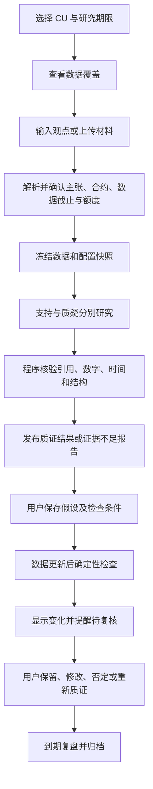
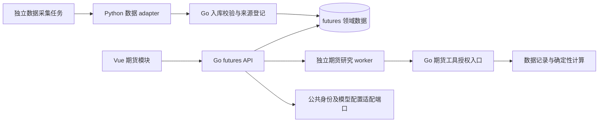

# 期货研究模块 PRD

| 项目 | 内容 |
|---|---|
| 产品 | 知股 Zhigu · 第四个业务功能 Tab「期货研究」 |
| 文档版本 | F-1.0 · 上线评审稿 |
| 日期 | 2026-10-04，Asia/Shanghai |
| 状态 | 需求、研发、QA、数据与运营可共同评审；尚未实现、尚未验收，不代表已获准上线 |
| 本期目标 | 完成单品种「数据观察 → 观点质证 → 保存假设 → 更新验证 → 到期复盘」闭环 |
| 首版试点 | 上期所沪铜 CU；通过真实数据准入后对获准用户开放 |
| 变更边界 | 增量增加期货模块；现有投研观点、交易策略、事件情报的接口、状态、结果与权限语义保持兼容 |
| 调研依据 | 公开 GitHub 仓库、许可证与实现边界核查，2026-10-02 |

本文中的范围、默认值和阈值是本次提出的产品需求，不是已有系统能力或交易所规则。评审通过后冻结版本；真实数据、模型、性能和回滚证据由上线验收另行提供。本文不替代既有模块 PRD/SPEC，不修改其边界。

## 1. 产品目标与成功定义

### 1.1 用户问题

用户看到一个品种上涨、库存变化或一条供需观点后，需要回答：

1. 当前观察到的事实是什么，来源和口径是否可靠？
2. 支持或反对这条观点的证据分别是什么？
3. 产业变化通过哪些环节影响价格，哪些环节尚未验证？
4. 判断适用于哪个品种、实际合约和时间范围？
5. 接下来应看什么，什么变化会要求修改或否定判断？

产品承诺是提供有依据、可核验、可持续跟踪的研究材料。P0 不提供真实交易、目标价、仓位建议、收益承诺或模型自报的上涨概率。

### 1.2 目标用户与任务

| 用户 | 主要任务 | P0 支持程度 |
|---|---|---|
| 有基础金融知识的个人投资者 | 看懂指标、验证观点、跟踪变化 | 首要对象；关键术语有解释，展示数据不足 |
| 初级产业研究员 | 检查材料、组织证据、记录证伪条件 | 支持个人研究；不含团队协作、企业数据采购流程 |
| 企业采购、销售或套保人员 | 管理现货敞口和套保 | 非本期用户场景；不生成套保方案 |

### 1.3 可测量价值

上线前招募至少 5 名目标用户，每人完成 3 项任务：说明主要矛盾、找到反向证据、说明修改观点的条件。至少 4 人能独立完成全部任务；每项任务限时 3 分钟，以事实准确且能定位出处计为成功。研究员评审记录与用户测试录像或逐项记录留档，不以“读完报告”计为成功。

上线后观察首份有效报告完成率、有效假设保存率、7 日内返回验证比例、证据打开率、用户纠错率。它们是产品观察指标，首版不以未建立基线的留存数字充当发布门槛。行情方向命中率与收益率不作为本模块的完成标准。

## 2. 范围与产品决策

### 2.1 本期固定决策

| 编号 | 决策 | 原因与验收含义 |
|---|---|---|
| D01 | 业务导航顺序为投研观点、交易策略、事件情报、期货研究 | 「个人界面」不计入业务 Tab；旧模块名称和打开方式保持不变 |
| D02 | `/app/futures` 在当前窗口内切换 | 不沿用事件情报的新窗口行为；保留旧模块草稿和浏览器返回位置 |
| D03 | 首个 live 品种为 CU，目录采用品种模板和上线白名单 | 首版不承诺全品种；新增品种需走同一准入流程，不在通用代码内堆品种分支 |
| D04 | 日频、盘后研究；研究期限为 7/14/30 个自然日，默认 14 日 | 不承诺实时盯盘；精确数据时点始终可见 |
| D05 | 全部计算基于真实合约或明确的现货口径 | 主力连续只作为趋势展示序列；不可当成可交易合约或用于跨期/基差计算 |
| D06 | 研究输入为观点文本、1 份文本型研报文件或二者同时提供 | 上传 PDF/DOCX/TXT；任意网页抓取、扫描件 OCR、多材料比较列入 P1 |
| D07 | 跟踪默认只进行确定性指标检查和站内提醒 | 新数据不自动启动付费模型、不自动改写观点；用户发起重新质证后才调用模型 |
| D08 | 当前授权范围内，数据/证据可复用；领域状态独立 | 不为期货创建伪股票、伪股票研究任务或伪 A 股事件 |

CU 是本 PRD 的试点选择，尚未完成数据实测。若其数据准入失败，保持 CU live 不开放，形成明确的数据问题单；换品种须修订本表、模板和验收集，不能静默改为“任何能取到的品种”。

### 2.2 优先级

| 级别 | 功能 |
|---|---|
| P0，发布必需 | 第四 Tab；CU 品种与实际合约；数据覆盖/来源/时效；供需指标；基差和期限结构；观点解析与确认；双向质证；证据抽屉；假设版本及条件跟踪；站内提醒；到期复盘；私有报告 HTML 导出；后台来源/准入/停用；监控与回滚 |
| P1，独立增量 | 更多品种；用户 CSV/XLSX 导入及映射；授权产业数据增强；季节性多年度分位；会员持仓专题；多材料比较；外部网页；OCR；授权数据内的跨品种研究 |
| P2，重新立项 | 期货回测、跨期策略绩效、期权、真实交易、企业套保、投资组合建议、跨资产自动推断 |

P0 的条件判断仅在已覆盖问题上输出；缺乏完整供需证据时明确输出“无法验证完整供需逻辑”。不能以新闻数量或行情走势补足缺失的供需数据。

## 3. 信息架构与交互

### 3.1 路由和页面

| 页面 | 拟建路由 | 内容及主要操作 |
|---|---|---|
| 研究首页 | `/app/futures` | 关注品种、待验证假设、已收录数据变化、更新状态；进入品种或新建研究 |
| 品种工作台 | `/app/futures/products/:productId` | 固定品种，实际合约选择；五个页签；日期与口径随图表呈现 |
| 新建研究 | `/app/futures/research/new` | 输入观点/文件、选择品种和期限、解析及确认 |
| 研究详情 | `/app/futures/research/:runId` | 任务进度、固定报告、证据、保存假设、重新研究、导出 |
| 假设详情 | `/app/futures/hypotheses/:id` | 当前版本、条件检查、差异、用户决策、复盘 |
| 通知 | `/app/futures/notifications` | 本模块站内通知；不占用既有事件情报通知表 |
| 数据管理 | `/admin/futures/sources` | 来源、使用权限、覆盖、更新故障、人工纠错与暂停；管理员入口 |

`productId` 使用完整交易所与品种身份，例如 `SHFE.CU`。实际合约使用目录返回 ID，不由前端根据当前年份猜测三位/四位年月码。

### 3.2 品种页五个页签

| 页签 | 必须展示 | 空态/缺口行为 |
|---|---|---|
| 研究概览 | 品种说明、研究范围、最新已发布研究、主要矛盾候选、支持/反对证据、关键未知项 | 没有研究时显示新建入口；不生成无来源的“今日看多/看空” |
| 产业与供需 | 产业链静态模板及版本；供应、需求代理、库存指标；来源、期间、频率 | 缺指标逐项标记；静态产业知识与实时指标分开 |
| 期现结构 | 实际合约行情；同一交易日的期限结构；指定近远月价差；匹配现货口径的基差 | 时间/单位/品质不可比时不计算，显示具体原因 |
| 观点验证 | 输入入口、当前品种研究记录、事实核验及推理链 | 未完成任务显示进度和取消；失败保留输入 |
| 跟踪复盘 | 活跃假设、待复核项、到期项、证据及结论版本差异 | 无假设时引导从研究报告保存，不预造用户观点 |

品种顶部显示「数据截至」「最后检查」「覆盖状态」，不以网页刷新时间替代数据更新。图表默认查看最近 60 个有效交易日，可选择 20/60/120 日；不足时显示实际起止和缺口，不能静默补点或改变期间。

首页“变化”来自数据值变化、修订、条件触发及已接入官方事件。所有变化带来源和关联假设；没有证据支持的价格归因标为研究问题，不写成事实。行情涨跌幅排行榜和全网新闻流不属于 P0。

### 3.3 交互规则

- 桌面使用现有品牌、色彩和组件样式；期货专属 CSS 限定作用域。窄屏以页签切换，表格允许局部横向滚动，页面在 390px 宽度无整体横向溢出。
- 证据抽屉显示原文/数据行、来源、单位、地区/品质、发布时间、采集时间、公式输入和版本；不能要求用户阅读 JSON 才理解结论。
- 切换品种/实际合约后，相关指标、引用和缓存必须同步切换；保留原研究任务的冻结快照，不把旧报告标题改成新标的。
- 离开期货 Tab 不取消任务；浏览器刷新恢复任务状态。跨模块切换不清空旧模块草稿，不自动发起新研究。
- 状态同时使用文字与颜色；核心操作支持键盘；图表提供数值表；关闭抽屉后焦点返回触发控件。

## 4. 端到端用户流程



### 4.1 FR01 输入与确认

- 观点文本 20–2,000 字；文件最多 1 份、20 MB，PDF/DOCX/TXT，要求可提取文本。文件与观点至少一项。
- 文件必须验证实际类型和可提取内容；最多 100 页、提取文本 120,000 字。超过限制提示缩小材料，不静默截断全文。解压、提取超时返回错误，不影响其他模块。
- 支持只传材料，从中抽取最多 12 条候选主张；超过 12 条时由用户选择本次研究的最多 12 条，保留原文定位。主张分为事实、推演、假设。
- 用户确认品种、实际合约（涉及价格/基差/价差时必填）、期限、主张、材料、来源覆盖、额度上限及截止时间后创建任务。使用“确认并研究”一次完成，不逐字段弹窗。
- 修改文本、材料、标的、期限或主张使解析 revision 失效。服务端校验确认 revision，重复确认用同一幂等键返回同一任务。
- `as_of` 为服务端创建任务时间；首版不支持任意历史时点新建研究。历史复盘仅查看已留存快照和当时已知版本；不能将今天抓取的修订数据冒充过去可得信息。
- 期限结束时刻按创建时北京时间加 7/14/30 个自然日计算并显示。若涉及价格判断，结束时刻必须早于所选合约的最后交易时刻；否则要求换合约或缩短期限，不自动换月。

### 4.2 FR02 研究与报告

支持与质疑角色读取同一个冻结数据清单，分别形成论据，不共享未完成结论。数据获取/计算工具固定白名单，模型不得任意联网、执行代码或自建数据源。各角色未找到证据只能标记未知，不能将另一角色失败当作己方成立。

报告必须包含八部分：

1. 研究问题、品种/实际合约、期限、截止时间与覆盖范围。
2. 条件性结论：支持、部分支持、被挑战、证据不足。
3. 逐主张事实核验：有支持、被反驳、前提缺失、仍有争议/未知。
4. 推理链：每一环的事实、计算、推断、假设与对应证据。
5. 最强反证、替代解释，以及无法排除的风险。
6. 期现结构与产业数据的一致/不一致处；不设“期限结构永远优先”的裁决规则。
7. 后续验证条件、失效条件和预计数据检查节点。
8. 证据索引、计算说明、数据缺口、模型/模板/公式/数据版本。

报告不输出模型主观填写的置信度百分数。数据覆盖率仅表示已通过质量检查的必需指标项数/模板必需项总数，缺失项列表同时呈现；不解释为观点正确概率，也不作为多空加权分数。

### 4.3 FR03 保存与跟踪假设

用户从报告中选择主张，生成假设草稿，可编辑后点击“保存并跟踪”。保存时明确披露：指标检查与站内提醒会自动运行；重新调用模型需要用户点击。每用户最多 20 条活跃假设，终态历史不计入。

假设必须具有：命题、范围、研究报告来源、期限、至少 1 个验证条件、至少 1 个失效条件、检查方式、缺失数据处理说明。条件可以是可计算指标，或人工核查事项。只有人工事项的假设在详情页明确显示“需人工验证”，不宣称全自动跟踪。

示例（仅说明机制，不代表当前 CU 判断）：

> 未来 14 日铜供应收紧；跟踪同口径交易所库存是否连续两个发布周期下降，同时检查需求代理是否出现反向变化。库存下降只支持其中一环，不能自动确认全部命题或价格方向。

### 4.4 FR04 复盘与导出

- 到期自动停止常规条件巡检，产生“到期待复盘”项；缺数据时标明无法验证，不将“没有触发失效”解释为假设成立。
- 复盘分开记录：事实是否兑现、传导是否得到支持、涉及价格时合约表现如何、数据是否足以判断。价格方向正确不自动证明研究逻辑正确。
- 用户可填写“保留待观察/修改/否定”的理由；重新研究产生新任务和关联版本，旧报告不覆盖。
- HTML 导出包含原观点、数据截止、缺口、来源索引、版本和生成时间；文件仅对所有者可取，不创建公开分享链接。无再分发权的数据不得随导出附带原文或数值，显示受限来源说明。

## 5. 数据准入与指标口径

### 5.1 FR05 CU 首版数据集

| 指标组 | P0 口径 | live 开放前最低覆盖 | 不满足时 |
|---|---|---|---|
| 品种与合约目录 | 交易所、品种、实际合约、挂牌/最后交易日期、乘数、最小变动、日历及版本 | 试点全部存续合约及所展示历史合约；字段与交易所材料核对 | 禁止 CU live 研究 |
| 实际合约日行情 | 开高低收、结算价、成交量、持仓量；单位明确 | 品种可形成至少 60 个交易日的已标换月趋势；单合约按实际存续展示；最新日 ≥2 个有成交且未到期合约 | 禁止相关期现计算；首发门槛不通过 |
| 期限结构 | 同一交易日、同一品种、同一价格类型，默认结算价 | 至少 2 个符合条件的实际合约 | 显示不足，不插值造合约 |
| 现货与基差 | 一种固定、可解释的铜现货报价，明确地区/品质/含税/单位/报价时点 | 与期货可对齐的至少 60 个交易日 | 首发门槛不通过；运行期只停基差能力 |
| 交易所库存 | 指定统计范围、单位、频率；与仓单分列 | 至少 26 个有效周度发布点 | 不计算库存趋势；首发门槛不通过 |
| 仓单 | 指定交易所/地区范围、原始单位及换算 | 至少 60 个交易日 | 缺口明示；首发门槛不通过 |
| 供应指标 | 国内精炼铜产量，实际统计期间，区分累计与当期 | 最近至少 12 个有效发布期 | 首发门槛不通过 |
| 需求代理 | 国内铜材产量，明确它是需求代理而非实际终端消费 | 最近至少 12 个有效发布期 | 首发门槛不通过；不得从价格倒推需求 |
| 官方材料 | 交易所合约与制度变化、与 CU 明确相关的官方统计说明 | 已配置来源覆盖内增量获取；保存覆盖窗口和原文定位 | 来源失败显示覆盖受限，不承诺全网监控 |
| 成本、利润、开工、社会库存 | P0 可显示模板定义及缺口；只有经准入的数据才展示数值 | 非首发硬门槛，不假定已有商业数据订阅 | 缺少时禁止据此产生确定结论 |

“12 个发布期”按源口径计数，1–2 月合并发布不能拆成两个虚构月值。同比、环比只在期间、单位、统计口径可比且分母非零时计算；不存在对应历史时显示不可计算。新增代理指标必须明确代理关系与局限，不能静默替代原指标。

来源选择顺序：可使用且已验证的官方来源；经授权的供应商；可验证上游定义的 AKShare 适配。AKShare 是接口适配工具，不是数据权利来源。TqSdk/iFinD/Wind 不设为首版必须购买项，也不得在没有凭据时宣称已接通。

### 5.2 FR06 来源登记与质量状态

每个来源在启用前登记：`source_id`、发布主体、原始链接/定位方法、数据许可与展示/导出/保存范围、凭据引用、字段定义、频率与发布时间规则、分页方法、历史覆盖、限流、超时、重试、主备优先级、采集版本及负责角色。不得在 PRD 中臆造供应商 endpoint。

观测状态分离为三轴：

| 轴 | 允许值 | 含义 |
|---|---|---|
| 获取状态 | available / missing / fetch_failed / not_entitled | 是否拿到数据，以及缺失原因 |
| 时效状态 | current / delayed / stale / unknown | 相对于该来源预期发布计划是否更新 |
| 核验状态 | source_recorded / cross_checked / conflicted / retracted | 已保存来源、已交叉核对、存在冲突或已撤回；不是观点正确性 |

不同质量轴不能压成一个“可信度分数”。数据质量不足、源失败或授权不足不能被显示为 0、无变化、库存耗尽或需求消失。

### 5.3 FR07 时间、更新和修订

- 精确时刻 UTC 存储、北京时间展示；另存交易所交易日、指标所属期间、原始发布时间及其精度、平台首次观察时间、取得时间、来源修订时间和版本。
- 夜盘所属交易日取交易所/供应商经过验证的日历，不使用自然日直接分桶。节假日不伪报应有日行情缺失。
- 截止判断使用 `usable_at`：可靠原始发布时间与该版本可获得时间中较晚者；缺乏可靠版本可得时间时使用平台首次观察时间。仅有日期时保守取当地日末，保留日期精度标签。`usable_at > as_of` 不可进入该次研究。
- 今日取得的历史修订序列可用于当前研究，但不得证明历史当时已知；报告显示该版本的取得和可得时间。
- 已有准确发布时间的来源：日频公布后 60 分钟、周/月频公布后 24 小时仍未拿到预期值记 delayed；到下一预期发布时刻仍缺该期记 stale。发布时间未知记 unknown，不能臆造 SLA。所有时间规则纳入来源配置版本。
- 采集在各源预计发布后启动；只有值、来源版本或撤回状态变化才产生观测事件。日内重试间隔至少 15 分钟、最多 3 次，且不超过来源限流；之后等下次计划或管理员触发。
- 同一记录修订新增 revision，旧值保留。明确修订/撤回替代旧版本；无替代关系的同级冲突并列展示，不按抓取先后选赢家。
- 修订使依赖的计算和条件检查产生新版本；历史报告保留并标“依据已修订”，不能修改其当时正文。撤回的数据退出当前计算，但保留允许保留的审计定位。

### 5.4 FR08 公式与可比性

| 计算 | 固定语义 | 前置条件 |
|---|---|---|
| 基差 | `现货价格 - 指定实际合约价格` | 同单位、币种、品质/地区口径和交易日；现货报价与期货收盘/结算时点分别显示，标明非同步快照；数据无法对应同日时不算 |
| 基差率 | `(现货 - 期货) / 现货 × 100%` | 现货价格大于 0；公式在界面可展开，不沿用来源未核验的 basis 字段 |
| 跨期价差 | `到期较近合约价格 - 到期较远合约价格` | 同品种、同交易日、同价格类型；按实际到期时间排序，不能按合约字符串排序 |
| 库存变化 | `本期同口径库存 - 上一期同口径库存` | 期间连续、口径一致；缺一期则不当作普通环比；仓单不替代社会库存 |
| 库存变化率 | `变化量 / 上期库存 × 100%` | 上期大于 0；否则只展示绝对变化与不可计算原因 |
| 数据覆盖率 | `通过质量检查的必需指标项 / 模板必需指标项` | 记录分母模板版本；展示缺项；只用于覆盖说明 |

计算采用确定性数值服务，保存原始输入 ID/版本、公式版本、精度和舍入规则；内部 Decimal，显示价格按目录价格精度、百分比 2 位小数，触发条件比较舍入前数值。条件包含阈值时保存单位，不依赖格式化字符串。

主力映射由来源定义并保存日期及映射版本。主力切换需标记；连续序列不得直接计算实际持有收益、基差或跨期价差。首版不做展期收益率或年化 carry 的统一展示，避免未经验证的跨品种假设。

## 6. 证据与报告发布规则

### 6.1 FR09 证据对象

所有事实引用必须映射到本模块已登记记录。证据至少包含：ID、所有者/可见范围、mode、品种及实际合约（适用时）、来源主体与来源簇、来源类型、定位、原文片段/数据行、指标/数值/单位/统计期间、时间字段、内容哈希、来源版本、修订/撤回关系及使用权限。

来源类型独立定义为期货契约中的 `official_release / market_data / industry_data / user_document / calculation / fixture`。不能直接向旧股票证据枚举加入值并让旧客户端被迫接受。来源等级不替代逐命题核验：官方对未来的预测仍是预测。

计算证据指向输入证据及公式；图表点可定位观测。上传研报标为用户提供，不自动取得其引用材料的官方等级；转述和转载不能算作多份独立证据。任何外部文本中的指令都作为材料，不改变工具权限、模型提示或发布规则。

### 6.2 FR10 发布条件与失败区别

| 执行结果 | 页面及报告行为 |
|---|---|
| 两角色成功，数据足够且校验通过 | 发布完整报告，给出条件性总体结论 |
| 两角色成功，但关键证据不足 | 发布“证据不足”完整报告，列出缺口；不生成确定方向 |
| 任一角色、必要数据工具或模型调用失败 | 任务为 failed；可显示已生成的部分材料，但 `quality=incomplete`、无总体结论，不冒充正常证据不足 |
| 引用越权/无定位、关键数字不符、未来证据、结构不合法 | 发布阻断；最多 1 次受预算限制的修复，仍失败则 failed |
| 当前来源撤回或报告依据被修订 | 旧报告加醒目提示；新研究生成新版本，不覆盖原报告 |

事实的证据 ID 必须在该任务许可的证据集中。重大数字只能来自已登记观测或计算；模型推导必须有前提和局限。未通过完整性检查的结果不得导出为正式报告或直接用于自动跟踪。

## 7. 假设、条件与通知状态机

### 7.1 FR11 状态分离

| 维度 | 值 | 变化权限 |
|---|---|---|
| 生命周期 | draft / active / paused / expired / closed / deleted | 用户激活、暂停、恢复、关闭、删除；服务端按截止时间置 expired |
| 用户观点 | undetermined / retained / revised / rejected | 仅用户确认；必须绑定理由及证据/检查记录，允许注明证据不足 |
| 检查结果 | pending / met / not_met / unknown | 程序按冻结条件及有效数据确定；manual 条件由用户填写并记录出处 |
| 待复核 | true / false | 新相关证据/条件变化/修订/撤回置 true，用户处理到明确版本后置 false |

系统不会因一个条件命中自动把整个假设置为“已证实”或“被否定”。用户修改命题、范围、期限或条件产生新 hypothesis_version；旧版本和检查历史保留。只有备注修改可不产生新的语义版本，但仍留审计记录。

允许的生命周期迁移：draft → active（必填项及条件校验通过）；active ↔ paused；active/paused → expired（到期）；draft/active/paused/expired → closed（用户关闭）；任一未删除状态 → deleted。expired/closed 不直接恢复，继续研究须创建关联的新假设并重新确认期限和条件。deleted 不可恢复；用户观点修改不隐式改变生命周期。

### 7.2 FR12 条件定义和计算

P0 支持 `metric_compare`、`metric_change`、`consecutive_periods` 和 `manual` 四类条件。一个条件绑定一个规范化指标序列、固定范围、运算符、阈值及单位；连续条件支持 2–4 个发布期。一个假设最多 5 个验证条件、5 个失效条件，逐项展示结果，不计算综合多空分数。

- 条件角色分 `validation` 和 `invalidation`，同一检查器只决定是否触发；不能把“条件成立”混同于“命题成立”。
- 首次激活时有足够当前数据则计算初值；已经满足的条件只显示初值，不制造“刚发生”的市场变化通知。
- 连续发布期按指标发布频率判定；某一期缺失、冲突、撤回或口径变化则 unknown，不跳过缺期连成满足。
- 依赖指标时效为 delayed/stale/unknown 时，当前检查为 unknown；保留并明确标记上次有效结果及时间，不用旧值制造新的条件命中。
- 相同规范化指标、统计期间和范围的值修订会重新检查。用户已处理的结果发生修订时重新置待复核，生成“数据修订”通知。
- 对已过期合约、已关闭假设不继续普通检查；有效留存期内影响其历史结论的修订仍可标记复盘记录，不重开假设。
- 范围变更、品种新增、公式变更不自动套用旧条件。升级模板时既有版本冻结，用户选择迁移才产生新版本。

### 7.3 FR13 站内通知与幂等

触发通知的事件：有效检查结果发生变化、关键证据修订/撤回、数据由可用变为不可用、到期，以及研究任务完成/失败。重复拉取相同数据不通知；无关新闻不通知；全站来源停用对同一用户/来源/故障周期只发一次。

通知唯一键包括 owner、mode、hypothesis_id、hypothesis_version、condition_id、检查版本、事件类型；任务通知使用 run_id 和终态版本。数据变化经事务 outbox 写入后异步投递，重试不产生重复通知。

新观测登记后 5 分钟内完成确定性检查并可在站内看到通知，此 SLA 不包含上游尚未发布/尚未允许访问的时间。通知链接到变化前后值、来源和受影响条件；读/未读独立于假设状态。用户暂停假设停止普通检查，到期计时仍继续；恢复时评估当前值并标记“恢复时检查”，不重放全部旧提醒。

## 8. 执行、预算与恢复

### 8.1 FR14 任务状态

`queued → running → verifying → succeeded`；任一执行阶段可进入 failed。用户取消为 `canceling → canceled`，只在 worker ACK 或租约失效后释放执行槽。取消、删除、已终态任务的迟到回包不得发布报告。

单次运行绑定 owner、mode、输入 revision、数据清单、模板、模型配置、工具策略、公式及预算快照。客户端每 2 秒查询进度；后台显示排队、获取证据、支持研究、反证研究、核验、完成等可解释阶段，不用虚假百分比。

获取证据不能推进已冻结的 as_of；执行中新增登记的数据仅在可验证其该版本于截止前已可得时允许使用，否则须新建研究。获取证据时间计入 180 秒执行上限。

worker 使用租约和执行代次防止重复写入。服务重启：排队任务保留；执行中任务在租约失效后置 failed 并说明中断，P0 不自动重跑付费模型。用户重试创建新 run 并关联原任务；重复网络提交则依幂等键返回原 run。

### 8.2 FR15 配额与成本（灰度默认值）

| 项目 | 默认上限 | 规则 |
|---|---:|---|
| 用户活跃研究 | 1 个 | queued/running/verifying/canceling 均计入 |
| 模块执行并发 | 2 个 | 独立队列/资源池；不得占用旧模块保留槽位 |
| 用户正式研究 | 5 次/北京时间自然日 | 幂等重复不重复计数；用户主动重跑占新次数 |
| 模块用户每日模型费用 | 5 元 | 与任务数量共同约束，先触发者生效 |
| 模块全局每日模型费用 | 50 元 | 是产品预算上限，不是供应商报价；未配置费用映射时 live 模型禁用 |
| 单次研究 | 8 次模型调用、24 次工具调用、48,000 总 token | 同一草稿从首次解析起累计，含全部 revision 重解析、修复与报告；输入输出合计；解析消耗按用户同日预算计入并在确认页展示。新建草稿也不重置每日费用额度 |
| 时间 | 排队 60 秒、开始执行后 180 秒 | 超时分别失败，不无限占槽 |

模型费率由实际配置验证并冻结，可见额度展示最大可用预算而非保证成交价格。调用前按最大输入输出预留费用，实际回执后核销；超时/未知 usage 不立即释放已占费用，后台对账。取消不抹掉已发生费用。

这些限额只属于 futures namespace，不改变旧模块的用户次数、费用和模型配置默认值。首次点击解析明确告知会使用模型额度；后续解析频率每用户每分钟不超过 5 次。超限保留草稿，可查看已有材料，不调用模型。

## 9. 领域边界与代码扩展性要求

### 9.1 当前代码事实及约束来源

| 代码事实 | 对新增模块的约束 |
|---|---|
| [主导航](../app/web/src/components/workspace/SideNav.vue)包含股票研究上下文与事件独立窗口逻辑 | 只增量增加期货入口；不改变旧导航行为；新增期货状态不得借用股票 conversation store |
| [ConsumerLayout](../app/web/src/layout/consumer/index.vue)会加载股票目录、研究证据抽屉及模式提示 | 期货使用独立轻量布局，复用品牌/样式/纯展示组件；不得因进入期货而拉取股票目录或挂股票证据抽屉 |
| [EvidenceService.Register](../app/server/service/finance/evidence_service.go)依赖 finance ToolGrant、ResearchRun 和 ProviderRecord | 不能直接传 futures run 冒充 finance run；复用概念和无状态校验，通过明确适配边界演进 |
| [旧研究工具白名单](../app/research-service/app/policies.py)固定股票工具 | 新建 futures 工具策略和任务契约；不放宽股票 allowlist |
| [旧证据 Schema](../app/contracts/evidence.schema.json)拒绝额外字段且有固定枚举 | 保持旧 Schema 不变，新增期货版本化 Schema |
| [旧回测引擎](../app/server/service/backtest/engine.go)拒绝非股票资产 | 保留拒绝行为；不得顺手将旧引擎宣称为期货回测 |

### 9.2 AR01–AR08 必须满足的不变量

| 编号 | 不变量 | 评审/验收方式 |
|---|---|---|
| AR01 | 旧模块不依赖 futures；依赖方向为 futures → 公共能力端口 | import/依赖检查；禁止 finance/strategy/intel 的业务代码反向 import futures |
| AR02 | 旧 API 路径、字段、枚举、错误语义、默认值、数据库表和已有迁移语义不变 | 冻结旧契约及响应样例，关闭和开启期货各跑一次兼容回归 |
| AR03 | 期货页面、store、路由、API client、报告组件独立 | 页面切换、网络请求和状态隔离测试；不能复制旧股票大组件再加品种判断 |
| AR04 | 新品种和来源通过模板/adapter 注册，不改变主流程 | 用测试品种模板及 fake provider 做契约验证；fake 不进入 live；主工作流无 CU 专属 if/else |
| AR05 | 数据、公式、研究编排、条件跟踪、展示五类职责分离 | 每部分有独立接口与测试；不将抓取或模型调用写入 Vue 组件 |
| AR06 | 新功能可独立禁用、独立失败、独立恢复 | 注入源/worker/模块表不可用；旧三模块仍可工作 |
| AR07 | 复用必须经接口且不得扩大权限 | provider/model/evidence adapter 的 domain、owner、mode、run、scope 校验测试 |
| AR08 | 新依赖不会污染旧运行环境和首屏 | Python 期货依赖独立锁定、独立 worker；前端懒加载；旧测试与旧 worker 不要求安装 AKShare/TqSdk |

### 9.3 建议模块边界（行为约束强制，目录可由开发 SPEC 等价落实）

```text
app/web/src/modules/futures/       路由、布局、页面、store、API、展示组件
app/server/api/v1/futures/         期货 API、鉴权、输入和响应
app/server/service/futures/        任务、发布、假设、条件、来源与适配端口
app/server/model/futures/          futures_* 领域记录
app/futures-service/               独立 Python worker / 数据 adapter，独立锁文件
contracts/futures/v1/              API、记录、任务、报告、事件与测试样例契约
```

允许修改现有宿主的范围限于导航/路由注册、启动时模块注册、独立配置读取和测试接线。若需抽出公共能力，只能抽无期货业务语义的窄接口，原股票/事件入口的调用和响应保持不变并有契约测试；不得以新增 Tab 为由重写全站状态、统一所有资产模型或替换旧研究 Harness。

推荐独立 FuturesLayout，先复用品牌、设计 token、无状态展示组件。若现有导航组件读取股票 store，拆出纯菜单展示层或提供新轻量导航适配，保留旧入口兼容；不要在公共组件中继续增加多层 `route.path.includes()` 分支。

### 9.4 AR09 公共能力复用与调用链



研究任务优先使用已经入库的冻结快照；缺少必需数据先进入数据准备阶段，完成后再运行模型。数据 adapter 不回调模型/研究工作流，避免 Go→Python→Go 的无限工具递归。

身份复用现有 JWT 与 user_id。公共模型配置通过受限只读端口解析，凭据不进入任务 JSON 或浏览器；新增 futures 预算账本和任务权限。现有模型代理若依赖 finance run，必须建立新的模块适配入口，不注册假 finance run 绕过验证。Go 实现无状态校验/模型协议可复用，但权限检查不可跳过。

P0 不读写现有事件表，也不依赖其开关；只复用证据时间线和 outbox 的设计。后续跨模块引用通过带 owner/mode/版本检查的公开服务端口，不通过跨表隐式 JOIN。

### 9.5 AR10 存储与版本契约

| 领域对象 | 最小内容 | 变化方式 |
|---|---|---|
| ProductTemplate / Contract | 品种、指标、规则、实际合约、交易日历和来源版本 | 注册新版本；既有任务冻结旧版本 |
| Source / Observation | 原始记录、规范化数值、时间、质量、权限、修订关系 | append revision；禁止原地覆盖历史观测 |
| ResearchDraft / Run / Report | owner、mode、revision、输入与数据清单、执行状态、结论/引用 | 输入不可变；重跑新 run；报告单独版本 |
| Evidence / Calculation | 来源定位、记录版本、公式、输入依赖 | 任务引用固定版本；最新视图与历史视图分开 |
| Hypothesis / Condition / Check | 生命周期、用户观点、条件、检查结果、检查版本 | 乐观锁修改；检查结果追加 |
| ChangeEvent / Notification / Outbox | 事件 ID、关联对象、版本、去重键、投递状态 | 至少一次处理＋幂等消费 |

新表使用 `futures_*` 命名，外键只指向本模块对象；公共用户关联通过既有 ID，所有者检查在服务端执行。不得改写旧 finance/intel/strategy 表定义或既有迁移；期货迁移独立版本记录，禁用期货时不执行期货迁移。启用时迁移失败只使 futures unavailable，不使宿主退出；全局数据库不可用属于共同基础设施故障，应如实告警。

缓存键至少含 domain、mode、owner/授权范围、source、product、实际合约、metric、统计期间、口径、as_of/观测版本和公式版本。不可使用仅日期的跨品种缓存，也不可共享私有材料的模型结果缓存。

契约命名采用 `futures.record.v1 / futures.task.v1 / futures.report.v1 / futures.hypothesis.v1`；破坏性变化升大版本。旧报告 renderer 与旧契约永远不接收 futures payload。后续抽通用能力另行评审，不用无限制 `extra` 字段掩盖业务模型差异。

## 10. 拟建 API 行为合同

以下定义研发和 QA 必须共同遵守的行为；准确 OpenAPI、JSON Schema 和迁移属于开发 SPEC 交付项，不能凭本文宣称接口已经存在。统一使用既有 httpx 响应 envelope，错误码使用 `FUTURES_` 前缀，保留公共认证 401/403 行为。

| 接口组 | 拟建路径与方法 | 最低语义 |
|---|---|---|
| 能力 | `GET /api/v1/futures/capabilities` | 登录后返回可见性、模块模式、就绪状态、品种白名单、功能与限额；禁用时仍返回 enabled=false |
| 品种 | `GET /api/v1/futures/products`、`GET /products/:id/contracts` | 只列用户可用的 live 品种/合约及来源版本；不混入股票目录 |
| 工作台 | `GET /api/v1/futures/products/:id/workbench` | 指标、口径、来源、时效、覆盖、计算证据和快照 ID |
| 草稿/材料 | `POST /api/v1/futures/drafts`、`POST /documents`、`PATCH /drafts/:id`、`POST /drafts/:id/parse` | owner 绑定；更新校验 revision；文件成功提取后才能参与解析 |
| 研究 | `POST /api/v1/futures/runs`、`GET /runs/:id`、`GET /runs`、`POST /runs/:id/cancel` | 创建带 draft_id/revision/idempotency key；分页历史；报告与状态绑定版本 |
| 证据/导出 | `GET /api/v1/futures/runs/:id/evidence/:evidenceId`、`GET /runs/:id/export` | 校验任务归属、证据授权范围和导出权限；不只校验 ID 存在 |
| 假设 | `POST /api/v1/futures/hypotheses`、`GET/PATCH /hypotheses/:id`、`GET /hypotheses` | 来源报告/条件/期限；PATCH 携带 expected_version；409 时不覆盖并提示刷新 |
| 关注 | `GET/PUT /api/v1/futures/watchlist` | 单用户最多 20 个已准入品种；移除关注不删除研究或假设 |
| 通知 | `GET /api/v1/futures/notifications`、`PATCH /notifications/:id` | 游标分页、读/未读；只更新自己的通知 |
| 删除 | `DELETE /api/v1/futures/runs/:id`、`DELETE /hypotheses/:id` | 立即不可见、停止关联任务，启动私有数据清理；关联删除规则见 §11 |
| 管理 | `/api/v1/admin/futures/sources`、`/admission`、`/operations` | admin 权限；登记/暂停来源、准入、处理故障；不能直接编辑用户结论 |

表内省略前缀的路径继承所在行完整前缀。模块禁用时，能力查询、鉴权后的取消/隐私删除及管理员运行控制保留可用，其他业务接口返回 503 `FUTURES_DISABLED`；清理作业继续执行。未获准用户访问业务功能返回 403，但不阻断其已有对象的隐私删除；所有其他模块入口不受影响。不存在/不属于本用户的私有对象统一 404，避免枚举泄露。

同 owner/mode/operation 幂等键保留 24 小时；同键同请求返回原对象，同键不同请求哈希返回 409。后台内部入口使用独立服务身份和 domain/owner/run/task/expiry/args_hash 绑定的短期 grant；worker 不能仅凭服务 token 获取任意用户证据。

## 11. 权限、隐私与异常

### 11.1 FR16 权限与保留

- 私有草稿、文件、报告、假设、通知和导出都以服务端 user_id 为准。公共授权数据可共享缓存，用户材料、模型上下文、结果不可跨用户共享。
- demo 与 live 在存储、缓存、任务和预算上隔离；客户端不能指定 mode，mode 由服务端环境决定。P0 不提供匿名 demo；测试 fixture 只进入测试环境，明显标记且不能填充 live。
- 私有对象默认保存 30 日；被活跃假设引用的材料及报告保留至该假设终态后 30 日，单一证据链最长 90 日，达到上限时停止跟踪并提示导出/重新研究。编辑期限不无限延长旧数据保留；新的假设必须建立自己的有效引用链。
- 未关联研究的文件、废弃草稿保存 7 日。用户删除立即隐藏；24 小时内清理数据库正文、对象存储、向量/文本索引、worker 副本及缓存。不可恢复的 ID/哈希/计费审计可留 180 日，不留可重建私有正文。
- 删除报告若被假设引用，先展示影响范围；用户选择取消，或确认同时删除关联假设及其私有检查/通知。共享公共原始记录不因单用户删除而清空；其私有引用关系必须删除。
- 备份中私有数据最长 30 日轮转清除，恢复时先执行删除 tombstone 清单再开放访问。公共数据保存不得超过来源授权期限；期限缩短/撤权须失效缓存与导出，并在依赖报告上显示限制。
- 管理员可查看脱敏状态、错误、预算和来源健康；查看用户材料须用户针对该工单授权并记审计，不能因 admin 角色默认浏览正文。日志不记录凭据、完整提示词或用户原文。

### 11.2 FR17 异常矩阵

| 场景 | 用户行为 | 系统行为 |
|---|---|---|
| 来源超时/限流 | 看见旧数据时间与故障说明，可稍后重试 | 保留原快照、不补零；受控重试；不放大抓取负载 |
| 授权缺失/撤回 | 对应数据与依赖功能不可用 | 停用相关源；不回退 fixture 或绕过访问控制 |
| 数据缺页或历史不足 | 看见实际范围和缺口 | 只展示真实范围；要求完整窗口的计算阻断 |
| 数据冲突或修订 | 并列看到版本和来源 | 暂停依赖冲突的检查，状态 unknown；修订重算并留版本 |
| 不支持品种/合约 | 提示已开放范围或失效原因 | 不猜代码、不改查其他品种 |
| 模型失败/配额耗尽 | 草稿保留；已有数据可看 | 新调用停止，核销已知费用，未知费用待对账 |
| 上传失败/材料不可读 | 换传可复制文本的文件 | 不以文件名/标题冒充正文 |
| worker 重启/迟到返回 | 明确中断或取消 | 租约代次隔离，禁止旧回包发布 |
| 新模块不可用 | 期货页显示暂不可用 | 旧三模块仍正常；不改变旧健康检查语义 |

## 12. 非功能要求与上线观测

### 12.1 NFR01 性能与容量

以下是需要实测的验收阈值：测试硬件、网络、数据规模、模型版本记录在 manifest，不假定开发机等于生产环境。

| 项目 | 门槛及测量条件 |
|---|---|
| 首屏 | 已登录、正常网络、缓存命中的 CU 工作台可交互 P95 ≤ 3 秒；独立记录首次冷加载 |
| 查询 API | 20 个并发会话、合计 10 RPS 持续 15 分钟，缓存/数据库查询 P95 ≤ 800ms，非预期 5xx <1% |
| 研究 | 2 个执行并发、至少 30 次真实模型运行，创建到首个进度事件 P90 ≤5 秒，端到端 P90 ≤90 秒，执行硬截止 180 秒；排队单列 |
| 文件 | 在明确测试集的 20MB/100 页限制内，提取 P95 ≤30 秒；超限拒绝，不能拖垮宿主 |
| 跟踪 | 每批最多 2,000 条活跃假设，新观测登记后 5 分钟内完成检查和通知可见 |
| 原模块影响 | 同机同数据同流量基线下，开启期货并施加其额定负载，旧模块 P95 劣化 ≤10%，错误率增加 ≤0.1 个百分点；旧 P0 流程全部通过 |

前端只在进入期货时加载其图表/研究代码；关闭功能时不得拉取期货数据。数据拉取和文件解析放独立进程，CPU/内存及数据库连接配额明确受限；异步检查与用户查询分池，防止数据更新挤占旧业务。

### 12.2 NFR02 可观测性

必须记录 domain/mode/run/task/request/数据批次 ID、配置版本、耗时、队列长度、来源成功率、延迟、分页完整性、来源修订量、检查落后量、通知投递及去重、发布阻断原因、预算预留/核销/未知用量。

内容日志脱敏。监控面板分开显示数据问题、模型问题和系统故障；不能用报告生成成功率掩盖大量“证据不足”。核心告警为：live 混入 fixture、越权、未来数据进入报告、预算超上限、重复通知风暴、旧模块性能退化。

## 13. 需求—验收追溯矩阵

每条验收需记录执行环境、数据/模型模式、版本、预期与实际、证据文件及执行者。以下全部为拟执行用例，当前均未验证；不以本文的存在标为通过。

| AC | 对应要求 | 输入/操作 | 唯一预期 |
|---|---|---|---|
| F01 | D01–D02 | 开启/关闭期货开关，跨四模块切换 | 第四业务入口正确；旧事件仍按原方式打开；旧草稿保留 |
| F02 | AR03 | 进入期货并打开证据 | 无股票目录请求/股票 drawer；无跨 store 污染 |
| F03 | D03、FR05 | CU 未过准入，直接访问与创建任务 | 禁止 live 任务，说明具体缺项；不能换成演示数据 |
| F04 | FR05 | 搜索其他品种或猜造实际合约 | 不进入 live 研究；不静默查询相似代码 |
| F05 | D05、FR08 | 连续合约用于基差或跨期计算 | 拒绝并要求实际合约 |
| F06 | FR08 | 现货 70,000、期货 69,500 元/吨 | 基差 +500，基差率约 0.71%；保留输入和公式 |
| F07 | FR08 | 近月 70,000、远月 70,300 | 跨期价差 -300，按到期日期排序 |
| F08 | FR08 | 来源返回“期货-现货”的 basis | 不直接沿用；按本产品公式重算并记录源口径 |
| F09 | FR05–FR08 | 不同交易日/单位/品质，或缺一期库存 | 不输出可比基差/环比；列原因，缺失不补零 |
| F10 | FR07 | 夜盘跨自然日及交易所休市日 | 使用正确交易日；休市不记数据缺失 |
| F11 | FR05 | 铜材产量及 1–2 月合并统计 | 显示需求代理与实际期间，不当终端消费、不拆虚构月值 |
| F12 | FR06 | 抓取失败但存在旧值 | 显示失败与旧值时间，不刷新数据日期、不生成零值 |
| F13 | FR07 | 仅日级发布时间，as_of 在当日中午 | 不把日末才保守可用的记录纳入研究 |
| F14 | FR07 | 后来取得的历史修订值 | 当前可用，旧快照不可被回填；来源版本明示 |
| F15 | FR06 | 供应商返回多页或仅 500 条 | 验证完整性；不足明确标记，不承诺完整历史 |
| F16 | AR10 | 同日两个品种、两个用户、demo/live | 不串数据、权限或模型缓存 |
| F17 | FR01 | 三种输入组合及不可读/超限材料 | 合法组合进入解析；非法材料明确失败，无伪摘要 |
| F18 | FR01 | 修改解析后文本/合约再用旧 revision 确认 | 409，重新解析确认；不创建旧输入任务 |
| F19 | FR01 | 期限跨合约最后交易时刻 | 要求换合约或缩短期限；不自动滚动 |
| F20 | FR01、§10 | 重复请求及同键不同输入 | 同输入返回同任务；不同输入 409；不重复扣次数 |
| F21 | FR02、FR10 | 双角色成功但缺少供需证据 | 正式“证据不足”报告，无确定价格方向 |
| F22 | FR10 | 任一角色失败 | failed/incomplete，无总体结论，不当反证成立 |
| F23 | FR09–FR10 | 引用其他任务/用户 ID 或未来记录 | 发布阻断；错误不泄露他人正文 |
| F24 | FR09–FR10 | 正文数字与计算结果不符 | 修复受次数/预算限制；不通过则不发布 |
| F25 | FR09 | 研报夹带“忽略规则/调用工具”指令 | 只当材料，工具权限和来源等级不变 |
| F26 | FR02 | 长报告、多转载、无独立证据 | 不自动增信，不输出概率评分 |
| F27 | FR11 | 保存假设后修改命题/条件 | 新版本；旧报告和检查不变 |
| F28 | FR12 | 连续两期下降，中间缺一期 | unknown，不跳过缺期制造满足 |
| F29 | FR12 | 激活时条件已满足 | 记录初值，不发“新市场变化”通知 |
| F30 | FR11–FR13 | 新数据命中失效条件 | 检查 met、待复核 true；用户观点不自动变 rejected |
| F31 | FR12–FR13 | 同观测重复投递/重启消费 | 一次有效检查和一次通知，无重复扣费 |
| F32 | FR07、FR13 | 同期数据修订使旧条件翻转 | 新检查版本、“数据修订”通知；历史结果保留 |
| F33 | FR11–FR13 | 暂停、恢复、到期 | 暂停停普通检查；恢复评估当前；到期停止并提示复盘 |
| F34 | FR04 | 到期无有效验证数据 | 无法判断，不自动算成功或失败 |
| F35 | FR13、FR15 | 开启假设跟踪后数据更新 | 不调用付费模型；只进行检查和站内提醒 |
| F36 | FR14 | 取消/删除后迟到回包、worker 重启 | 不发布旧结果；槽位按 ACK/租约释放；可显式重试 |
| F37 | FR15 | 用户/模块额度边界、未知 usage | 超限前阻止调用；未知费用待对账不立即释放 |
| F38 | FR16 | 改 owner/mode、猜文件或导出 URL | 服务端拒绝；同用户 demo/live 无交叉 |
| F39 | FR16 | 删除带关联假设的报告并确认影响 | 立即隐藏，24 小时内各副本清理；备份恢复不复活 |
| F40 | FR16 | 来源撤权后查看缓存/导出 | 遵循撤权限制；依赖结果标记，禁止继续分发 |
| F41 | AR01–AR02 | 开关两态跑旧接口与旧 P0 流程 | 三模块契约、默认值、结果保持原语义 |
| F42 | AR06、AR10 | 禁用时无期货依赖；启用时其迁移/worker 失败 | 宿主和旧模块可启动，期货独立不可用 |
| F43 | AR04、AR08 | 注册测试品种/provider，检查依赖和 bundle | 通用主流程无需改写；旧 worker 不装新依赖仍工作 |
| F44 | NFR01 | 指定负载与旧模块对照压测 | 达到 §12 阈值，保留原始时序而非只报平均值 |
| F45 | §3.3 | 390px、键盘、刷新、浏览器返回 | 核心功能可用，状态恢复，证据定位可访问 |
| F46 | FR04、FR16 | 私有导出及授权受限资料 | 导出有版本/缺口；他人不能取；受限原文不附带 |
| F47 | §14、FR16 | 灰度期间执行只读/禁用/回退，并取消任务、删除私有对象 | 新调用停止，旧模块无回退损失；取消/隐私删除和清理仍可执行，重新启用后仅恢复未删除且仍获许可的数据 |

## 14. 发布关口、灰度与回滚

### 14.1 功能开关

- 构建开关：`VITE_FUTURES_ENABLED`，默认 false，只决定前端是否具备模块代码与导航接入。
- 运行开关：`ZHIGU_FUTURES_ENABLED`，默认 false，是最终访问与执行门槛；capabilities 由服务端决定可见性。前端开而后端关时不展示业务入口，已有页显示停用状态。
- 管理运行模式：`off / read_only / live`。read_only 允许所有者查看仍有权限的历史数据和结果、标记通知已读、取消任务及隐私删除，停止新研究、采集和假设检查；live 开放准入范围内功能。off 拒绝普通业务接口，保留能力查询、鉴权后的取消/隐私删除及管理员运行控制；off/read_only 下清理作业均继续运行。
- 用户准入和品种白名单在服务端执行；不能靠隐藏 Tab 实现访问控制。运行模式及白名单变更写审计，缓存最长 30 秒；新外部调用前必须再次检查运行门槛。

### 14.2 上线关口

| 关口 | 必须提供的证据 | 签收角色 | 当前状态 |
|---|---|---|---|
| G0 需求与架构 | 本 PRD 冻结版本；开发 SPEC、契约、隔离与迁移方案；变更影响清单 | 产品负责人、研发负责人 | 未执行 |
| G1 数据与权利 | CU §5.1 必需指标实测；连续 5 个实际发布窗口/日频至少 5 个交易日的采集记录；慢频历史发布记录核对；访问与展示/保存/导出权限记录 | 数据负责人、产品负责人、相应权限审核人 | 未执行 |
| G2 工程与隔离 | F01–F47 中适用工程项通过；旧三模块开关两态回归；契约检查、隔离故障注入和迁移演练 | 研发负责人、QA | 未执行 |
| G3 研究质量 | 50 个有标注案例，含至少 10 个不足/失败、10 个冲突/修订/时间边界；至少 30 次真实模型链路；所有事实引用可定位，重大数字/时间错误 0；主张核验准确率 ≥90% | 研究评审人、QA | 未执行 |
| G4 性能与恢复 | §12 原始测量；预算边界测试；取消/故障/备份删除恢复/灰度回退演练 | 研发负责人、运维、QA | 未执行 |
| G5 用户验收 | §1.3 的 5 名用户任务记录和问题闭环 | 产品负责人、试用用户代表 | 未执行 |
| G6 发布 | 前述关口通过，版本清单、值班安排、监控、停用权限和回滚记录齐备 | 产品负责人、发布负责人 | 未执行 |

G3 的主张核验以两名具备商品研究背景的评审人预先标注并处理分歧的标签为准，按主张数量计算；不能在看到模型结果后改金标准。计数明确区分 fixture、真实历史数据和 live 模型。源未授权、关键数据不齐、跨用户泄露、未来数据、伪造数字、旧契约破坏、预算失控均阻断发布。

“来源已记录”不等于“独立核验通过”。G1 中月频数据不要求等待 5 个月，应使用至少 5 个真实历史发布窗口及其来源记录核对；日频仍须完成至少 5 个真实交易日观察。公共假期不能用模拟日替代。

### 14.3 灰度路径

G0–G5 通过后进入 G6 发布流程：先对 5 名内部指定账户开放，观察至少 2 个有效交易日；再对最多 20 名邀请用户观察至少 5 个有效交易日；满足质量、成本、性能和原模块无回归要求后，发布负责人决定是否扩大准入。观察时长按交易日计，覆盖至少一次真实数据更新，不用静态页面可访问代替。

发布 manifest 记录应用 commit、PRD/SPEC/Schema 哈希、模型/提示/公式/模板/来源版本、数据覆盖、开关/白名单快照、测试证据、签收时间与角色。本文不预填通过状态或代替签收。

### 14.4 回滚动作与触发

| 触发 | 动作 | 恢复要求 |
|---|---|---|
| 数据时效/准确性局部故障 | 停用对应源和依赖能力，保留时间标签与异常说明 | 修复后补数、复核依赖和修订通知 |
| 模型持续失败/模块费用将超上限 | read_only，停止新付费调用 | 对账、修正配额/模型配置并通过探针 |
| 越权、live 混入 fixture、未来证据或旧模块回归 | 立即 off，撤销未完成任务授权；新外部调用在 60 秒内停止 | 根因修复、专项回归、重新签收；已在途费用仍对账 |
| 期货查询非预期 5xx 连续 5 分钟 ≥5%，或旧模块达到 §12 退化边界持续 5 分钟 | read_only；若仍影响旧模块则 off 并停期货 worker | 恢复原模块基线后再评估 |

应用回退保留新增表，不执行破坏性 down migration；旧版本不得访问或依赖 futures 表。切 off 后数据依法保留、任务不可发布，读权限若因安全原因禁止则不通过 read_only 暴露。5 分钟内完成模块停用及宿主旧功能检查，演练留证。

## 15. 开源借鉴、交付物与评审结论记录

### 15.1 采用策略

| 仓库 | P0 策略 | 必须规避的问题 |
|---|---|---|
| AKShare | 固定版本的候选数据 adapter，实测后启用 | 固定历史默认日期、基差符号、分页、库存口径、上游权限 |
| TradingAgents_for_Futures | 参考维度与交互，独立实现计算与 Vue 展示 | 不搬入 Streamlit 全栈；不继承基于文本长度的置信度；历史日期必须过滤 |
| futures-research | 参考研究结构、反证与失效条件概念 | 调研 commit 未找到许可证，不复制脚本/模板正文；不使用按日期跨品种缓存 |
| TradingAgents | 参考职责分工和按当时已知结果复盘 | 不替换现有编排体系；不把公司财务工具当作产业供需工具 |
| TqSdk | 仅作为后续经权限验证的增强源 | 不把开源 SDK 视为数据服务免费/无限授权 |
| VeighNa CTA | P2 评估 | 不宣称已解决保证金、强平、结算与换月全部语义 |

仓库许可证、具体 commit 和代码证据见调研文档；复制允许复用的代码时需保留相关声明并完成依赖清单。第三方数据/附带数据集不因根目录代码许可而自动进入产品。

### 15.2 开发及上线必须交付

1. 本 PRD 的评审冻结版与逐条变更记录。
2. 对应开发 SPEC、OpenAPI/JSON Schema、领域状态转换表、数据字典与模块依赖图。
3. CU 模板、来源能力/权限清单、公式与对齐规则、原始数据快照及人工核对记录。
4. 独立的前后端模块、数据/研究 worker、增量迁移、预算、审计和故障配置。
5. 需求—测试映射及 F01–F47 证据、50 个研究质量案例、旧模块兼容回归、性能/恢复报告。
6. 值班手册、灰度/回滚操作、数据更正和用户删除处理流程、发布 manifest。

### 15.3 本文完成定义

本次文档可用于评审功能范围、资源投入、架构边界和上线门槛；未授权或未实现能力保持明确的发布阻断项。无须为了完成文档而改动业务代码、安装第三方系统或开放真实用户访问。

| 评审项 | 本文决定 | 后续结果登记位置 |
|---|---|---|
| 第四功能名称及位置 | 期货研究；与现有三业务模块并列 | G0 签收记录 |
| 首版是否含交易/回测 | 不含；期货研究闭环优先 | 范围变更记录 |
| 首版品种 | CU；真实数据准入未通过则不开放 | G1 来源及品种准入记录 |
| 是否可整体移植第三方仓库 | 不可；按明确职责选择性参考/适配 | G0 依赖与设计评审 |
| 是否允许修改旧契约以适配期货 | 不允许；采用新版本领域契约与适配端口 | G2 兼容性证据 |
| 当前是否已批准上线 | 否；G0–G6 均需真实证据及相应角色签收 | G6 发布 manifest |
