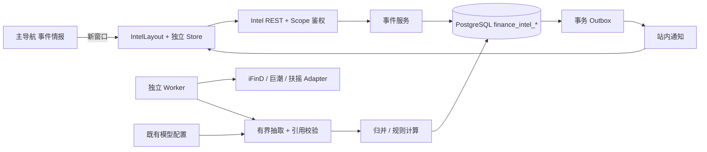

# 投资事件情报与证据时间线 · 开发与测试 SPEC

版本：I-1.0｜日期：2026-09-26｜基线：[PRD v1.2](../prd/投资事件情报与证据时间线_PRD_终稿.md)。

本文是待实现的研发与 QA 合同，不是实现完成报告。业务规则以 PRD 为准；本文冻结代码落点、接口、数据约束、执行流程与测试。接口、数据结构或业务语义变更须同时更新 PRD、本文、契约文件和测试，不允许只改一处。

仓库检查基线：分支 `feat/zhigu-editorial-frontend`，HEAD `2e0b329bf8bdf969a636d12ceda58b7051e7edf0`，含现有未提交修改。本次按工作区实际代码读取，不能把该 HEAD 当作全部所见代码的快照。交付验收必须记录届时的 commit、工作区差异和规则版本。

## 1. 模块定位与交付边界

### 1.1 同级模块

| 业务模块 | 前端入口 | 后端业务域 | 关系 |
|---|---|---|---|
| 观点分析，现有文案“投研观点” | `/app/research/new`、`/app/research/:id` | `service/finance`，研究任务及报告 | 既有独立业务线 |
| 交易策略 | `/app/strategies`，策略市场为其二级入口 | `service/workbench`、`strategy`、`backtest`、`strategy_market` | 既有独立业务线 |
| **事件情报** | **新窗口 `/app/intel`** | **新增 `service/intel`** | **与前两者同级** |

“个人界面”继续作为账户入口。导航顺序固定为：个人界面、投研观点、交易策略、事件情报。保留现有模块名称；“观点分析”是业务称谓，不在本次顺带重命名旧界面。

事件情报不得嵌入策略市场、策略编辑器或观点对话。不创建 ResearchRun 来冒充事件，不把事件通知写入研究历史，不共享策略自选表；三模块可以共用账号、数据库实例、品牌样式和已激活模型配置。

### 1.2 必交范围

P0 为 PRD 定义的 A 股收购、业绩预告、监管立案三类事件，以及关注、接入、归并、证据、状态、冲突、变更、站内通知、管理员纠错、隔离回放。聊天、外部推送、行情验证和交易联动不属于本次实现。

上线分开签收：① 演示链路；② 授权真实数据；③ 真实模型抽取；④ 用户理解与性能。任何一类通过均不能替代其他类。PRD 的 48 小时是 MVP 交付约束，不用于豁免事实、隔离、通知及出处要求。

## 2. 已核验的仓库接入点

下表“现有”仅表示代码存在并已阅读，未在本次运行验证。

| 现有文件 / 符号 | 现状 | 本模块处理 |
|---|---|---|
| `app/server/main.go` | 创建 PostgreSQL、研究服务、模型配置、市场及策略服务，直接注册 Gin 路由 | 增加独立 Intel Service、路由、Worker；不塞进研究编排 |
| `initialize/router_biz.go`、`gorm_biz.go` | 兼容入口为空；运行时路由在 main，表使用显式 SQL | 不能只修改空兼容入口并宣称接入完成 |
| `initialize/migrate.go` / `Migrate` | 嵌入 SQL、校验 checksum、事务迁移及迁移锁 | 新增 `006_intel.sql`，不改 001–005；编号被占用时递增并同步本文 |
| `httpx/auth.go` | JWT、用户/管理员角色；开发密钥有默认值 | 复用真实身份校验，增加 Intel 范围解析；公开部署禁用默认密钥 |
| `httpx/envelope.go` | `{data,error,trace_id}`，无 PRD 的 meta | 新建 Intel envelope，保留旧 API 协议 |
| `service/finance/config_service.go` / `Active`，`crypto.go` / `DecryptSecret` | 版本化模型配置、加密密钥 | 只复用配置解析；按任务冻结 config_id |
| `service/finance/model_proxy.go` / `Complete` | 依赖研究 run、task token、grant、预算 | 不直接调用，不伪造 run；新增有独立预算的抽取器 |
| `service/finance/llm_adapter.go` | 自动注入研究提示词，转发方法不接收任务 context | 不直接作为事件抽取器；只参考协议处理方式 |
| `service/finance/cninfo.go` | 未导出检索函数，默认最多 5 条、仅第 1 页，时间降为日期，定位为文本前缀 | 不可直接作为完整事件扫描或精确引用；新增独立 adapter |
| `service/finance/http_counted.go` | 固定金融源域名白名单，不含 iFinD/扶摇 | 新增 Intel 出站客户端，不扩大研究 grant 的权限范围 |
| `service/market/service.go` | 策略市场目录和行情服务，Search 会附行情 | 只读借用已核验目录作为可选缓存；不把实时行情调用带入事件搜索 |
| `app/web/src/router/finance.js` | Consumer/Admin 布局；守卫查 localStorage，登录无回跳 | 新增同级 IntelLayout 路由、演示分支和安全回跳 |
| `layout/consumer/index.vue` | 挂载即初始化研究 store、加载研究标的，渲染研究证据抽屉 | 新模块不得复用该有副作用的布局 |
| `components/workspace/SideNav.vue` | 固定三个入口，并直接依赖研究 store | 抽离纯导航元数据，研究目标由父布局传入；增加事件入口 |
| `utils/http.js` | 注入 JWT，旧 envelope 解包时只保留 data/trace_id；401 全局跳登录 | 新建 intelHttp；不能丢 meta，也不能让演示401清掉真实账号 |
| `stores/session.js`、`view/research/login.vue` | localStorage 账号，登录后固定到新研究，无跨窗口同步 | 增加安全回跳、storage 事件；保留无回跳时的原行为 |
| `testdb/postgres.go`、`api/v1/finance/testmain_test.go` | PostgreSQL 16 测试库、显式 reset、TestMain 关闭进程 | 扩展 Intel 表清理；新测试包同样关闭测试库 |
| `playwright.config.js`、`app/scripts/verify-stage-b.sh` | 现有 Chromium 和研究/策略证据分域 | 新建 Intel 专用配置和验收脚本，不把 Intel 结果记成策略通过 |

当前技术栈沿用 Go 1.24.1 / toolchain 1.24.2、Gin、GORM、PostgreSQL 16、shopspring/decimal、Vue 3、Pinia、Vue Router、Vite、Playwright。面客壳已使用 Semi UI Vue，登录等页面仍有 Element Plus；新壳复用现有 Semi 和品牌变量，不新增 UI 框架。

## 3. 前端独立窗口合同

### 3.1 窗口打开

1. 主导航新增“事件情报”，标注“在新窗口打开”，键盘可操作。原窗口 URL、未提交观点、策略编辑内容和进行中的任务均保持原样。
2. 用户点击时同步执行 `window.open`，目标为同源 `/app/intel`，`_blank`，请求 `popup=yes,width=1440,height=900,noopener,noreferrer`。禁止先 await 接口再开窗；一次点击最多一次调用，500ms 内防重复。
3. 桌面优先请求独立浏览器窗口；浏览器策略和移动端可能使用独立标签页。验收的硬要求是新浏览上下文、独立路由与状态；原页面内弹窗、抽屉、iframe、覆盖原页面均不算完成。
4. 使用 noopener 时返回值可能为 null，即使已成功打开；不能据此显示“被拦截”或自动再开第二个窗口。原页面提供非阻塞提示及原生 `target=_blank rel=noopener noreferrer` 重试链接，用户自行触发重试。
5. 不依赖 `window.opener`、postMessage 或 URL 传 token。新窗口直接按同源登录信息启动。内部详情/通知/设置用 router 导航，不不断新开窗口。
6. 新窗口含“返回事件流”“关闭窗口”及账户退出；手动输入 URL 时关闭可能受限，提供“可直接关闭此标签页”提示。需要返回其他模块时用显式同源链接，不尝试操控原窗口。

浏览器限制依据：[MDN window.open](https://developer.mozilla.org/en-US/docs/Web/API/Window/open)。应用不能保证绕过用户的弹窗策略。

### 3.2 路由

在 routes 顶层新增 `/app/intel`，使用 `IntelLayout`，与现有 `/app` 的 ConsumerLayout **并列注册**，不得放入其 children。静态 demo 路径先于动态 ID；演示 routes 共用同一组页面组件，以 route meta 指定模式。

| 路径 | 页面 / 权限 |
|---|---|
| `/app/intel` | 真实事件流，需登录 |
| `/app/intel/events/:id` | 详情；可选查询参数 version；历史版本只读 |
| `/app/intel/watchlist` | 关注管理 |
| `/app/intel/notifications` | 当前用户通知 |
| `/app/intel/admin/reviews` | 待处理与归并/抽取纠错，需 admin |
| `/app/intel/admin/sources` | 采集任务、材料导入、覆盖状态，需 admin |
| `/app/intel/demo` | 匿名演示入口；进入不默认生成会话，点击“开始演示”才创建 |
| `/app/intel/demo/events/:id`、`/watchlist`、`/notifications` | 均在 `/app/intel/demo` 下；页面带水印，只用演示 Cookie |

表中详情实际匹配模式为 `/app/intel/events/:id`，版本通过 `to.query.version` 获取。分享真实事件链接不授予访问权；演示链接在另一浏览器没有原会话时显示“请开始演示”，不暴露原演示空间。

### 3.3 登录与状态隔离

- 守卫使用明确的 route meta `module=intel,mode=live|demo,requiresAdmin`，不能仅以含有 demo 字符串放行。
- 真实模式未登录转 `/login?redirect=编码后的同源路径`；登录成功回到指定详情/版本。redirect 只允许预定义 `/app/`、`/admin/` 内部路由，拒绝协议、双斜杠、外域及登录循环；无效值回原默认 `/app/research/new`。
- Intel 请求层真实401清理真实会话，保留安全回跳；演示401只清理本窗口的演示状态，提示会话失效，不清空 zhigu_token。
- 全局监听 `storage` 中 token/user 变更：取消请求、清空当前用户缓存，再验证新身份；不能把旧响应展示给新账号。退出事件同步到各真实窗口；这只代表客户端会话同步，不宣称现有 JWT 已实现服务端主动撤销。
- `useIntelWorkspace` 独立于 researchConversation、strategyWorkspace。不共享 evidenceOpen、当前研究 ID、策略草稿、fixture 标记或路由缓存；禁止在 IntelLayout 挂载研究 store。
- URL 保存筛选和历史版本，敏感信息不入 URL。组件卸载停止轮询、取消请求；旧请求必须校验 request sequence、namespace、session generation。
- 新窗口刷新先请求 `/session`，再加载关注及数据。真实模式忽略演示 Cookie；demo 明确不发送 JWT。不得通过检测 localStorage 中有 token 就把演示请求变成真实请求。

### 3.4 页面组件与刷新

首页卡片固定显示“核实状态 / 业务阶段 / 信息新鲜度”三轴，不拼成一个状态枚举；未知影响显示“待评估”。详情头部一屏回答 PRD 五个问题；下方为变化、时间线、证据、冲突、历史。引用抽屉是 Intel 自有组件，展示允许片段、来源日期、失效状态及原文链接。

采用 REST 轮询，不要求 WebSocket：可见窗口每30秒刷新通知，事件流/详情每60秒刷新；用户操作及回放步骤后立即刷新。不可见窗口暂停，恢复可见时补拉。轮询携带取消信号，失败使用5/15/30秒有界退避；不得叠加定时器。

375px 以上可操作，冲突左右对照在窄屏改纵向；状态不能只靠颜色。引用、表格数值可选中复制。历史版本显示固定版本与时点，不因后台刷新替换；顶部另提示“已有新版本”。

## 4. 目标架构与代码落点



### 4.1 新建文件（计划落点）

| 文件 / 目录 | 职责 |
|---|---|
| `app/server/api/v1/intel/{routes,auth,envelope,handlers,admin}.go` | 路由、Scope、严格 DTO、响应、角色边界；不计算业务结论 |
| `app/server/model/intel/models.go` | 表映射；不使用 AutoMigrate |
| `app/server/service/intel/{service,types,repository}.go` | 依赖注入、领域类型、强制 namespace 查询 |
| `app/server/service/intel/{identity,evidence,rules,versions}.go` | 事件身份、引用/有效性、纯规则计算、原子变更 |
| `app/server/service/intel/{ingestion,worker,leases,outbox}.go` | 持久任务、租约 fencing、巡检、通知投递 |
| `app/server/service/intel/{sessions,subscriptions,replay}.go` | 真实/演示身份、关注资格、回放与清理 |
| `app/server/service/intel/{extraction,model_client,coverage}.go` | 冻结模型抽取、预算、覆盖与时点 |
| `app/server/service/intel/providers/{types,http,ifind,cninfo,fuyao,fixture}.go` | 供应商协议归一化、限定域名和响应尺寸 |
| `app/server/service/intel/prompts/extract-v1.md` | 抽取提示词，外部文本只作为数据 |
| `app/server/migrations/finance/006_intel.sql` | 独立新增表、索引和约束 |
| `app/web/src/layout/intel/index.vue` | 独立壳、标题、自己的证据抽屉及覆盖提示 |
| `app/web/src/view/intel/{index,detail,watchlist,notifications,reviews,sources}.vue` | 页面；demo复用而非复制实现 |
| `app/web/src/components/intel/` | EventCard、ConclusionCard、Timeline、EvidencePanel、ConflictPanel、ChangeDiff、ReplayControls |
| `app/web/src/{api/intel.js,utils/intelHttp.js,utils/openModuleWindow.js,stores/intelWorkspace.js}` | REST、envelope、开窗、独立状态 |
| `app/web/src/config/modules.js` | 一级模块元数据与打开方式，纯配置 |
| `contracts/intel/{openapi.yaml,extraction-v1.schema.json,rules-v1.json}` | OpenAPI 3.1、抽取 Schema、确定性规则版本 |
| `contracts/intel/fixtures/events-v1/` | 原文、元数据、预录抽取与独立人工预期 |
| `app/web/playwright.intel.config.js`、`app/web/e2e/intel-*.spec.js` | 独立窗口、契约、真实本地链路及跨浏览器测试 |
| `app/scripts/verify-intel.sh`、`app/scripts/intel_manifest.py` | 本模块测试执行与证据汇总 |

### 4.2 修改现有文件

仅在以下接点修改：`main.go`、`testdb/postgres.go`、迁移测试；前端 `router/finance.js`、`components/workspace/SideNav.vue`、`layout/consumer/index.vue`、`stores/session.js`、`view/research/login.vue`、`main.js`；部署环境样例、`app/README.md`、主导航回归用例。

SideNav 去掉直接研究 store 依赖，由 ConsumerLayout 传入当前研究目标，AdminLayout 继续传入自定义 items。IntelLayout 使用纯导航与自身 header，不加载 WorkspaceHeader 的“新研究/删除研究”等动作。旧 HTTP 客户端不改 envelope 行为；共用登录回跳辅助函数时必须补旧模块回归。

### 4.3 服务边界

| 服务操作 | 输入 | 输出 / 保证 |
|---|---|---|
| `ResolveScope` | HTTP 身份、显式 mode | 不可由客户端伪造的 Scope：principal、namespace、role、generation |
| `IngestRevision` | Scope、标准材料、幂等键 | 来源修订与异步 job；相同来源修订不重复建 |
| `Extract` | 不可变修订、冻结配置、预算 | 可校验 Extraction；失败隔离，不伪装成功 |
| `ResolveIdentity` | 合法抽取、精确历史索引 | same/new/review，附决定依据，不只返回概率 |
| `Evaluate` | 证据快照、来源关系、规则版本、as_of、coverage | Snapshot；不访问网络、系统时钟或可变全局配置 |
| `ApplyChange` | Scope、预期事件版本、冻结计算结果 | 一个原子版本及 Outbox；版本不符拒绝，无部分写入 |
| `Deliver` | Outbox 租约、发送时资格 | 0或1条用户通知；重放不重复 |
| `ReplayStep/Reset` | demo Scope、expected_version、幂等键 | 新 replay_version；不改变真实时钟或真实数据 |

以上符号为拟建接口名，不是声称现有代码已提供。后端 Go DTO 与 OpenAPI 同步生成或同一契约测试校验，避免各层各起一套字段名。

## 5. 数据库合同

### 5.1 公共约束

- 全部业务表以 `finance_intel_` 为前缀；不得扩展 research report Schema 或复用研究 evidence 表承载长期事件。
- ID 为带类型前缀的随机字符串；时间 `timestamptz`，十进制权重/金额用 numeric 或规范化十进制字符串，禁止 float 聚合。UTC 精确时点与日期/区间对象分开存。
- 公共证据仅在同一真实 namespace 共享；演示每个 Cookie 会话拥有独立 namespace。每个业务对象具备 namespace_id；子表用复合 FK `(namespace_id,parent_id)`，防止跨空间引用。
- 私有行同时含 principal_id；principal 从会话映射，真实 principal 关联 `finance_users.id`，演示 principal 不伪造真实用户 ID。
- source_revision、已验证抽取、Snapshot、Change 和审计为追加记录。当前指针可变，历史内容不可原地覆盖；撤回/授权清理可删除受限正文，但保留哈希与删除原因并显示“不可再核验原文”。
- 常用过滤字段单列并建索引，JSONB 只用于参数、diff、引用集合和冻结 payload；不能把全部查询字段塞进一个 JSON。

### 5.2 最小表与索引

下列为必需逻辑结构；每张表的普通时间字段从公共约束继承。完整 DTO 见 PRD §5.4。

| 表后缀 | 核心字段 | 唯一性 / 索引 / 特别约束 |
|---|---|---|
| principals | id、kind、user_id? | live 必须关联真实 user，demo 的 user_id 为空；live user 唯一 |
| namespaces | id、kind、owner_principal_id?、generation、expires_at? | live 为固定共享空间；demo 必须有 owner/TTL；generation≥1 |
| sessions | id、token_hash、principal_id、namespace_id、expires_at、replay_version、simulated_at | token_hash唯一；只存随机令牌哈希；命中过期返回401 |
| instruments | namespace_id、code、name、exchange、entity_id、aliases、provider、catalog_as_of | `(namespace_id,code)`唯一；demo代码不得进入live |
| sources | id、namespace_id、provider、provider_doc_id、source_key、canonical_url、publisher | `(namespace_id,provider,source_key)`唯一；source_key优先文档ID，其次规范URL |
| source_revisions | id、source_id、revision_no、revision_hash、content_hash、规范文本/片段、rights、四时间、parser_version、root_links | `(namespace_id,source_id,revision_hash)`及revision_no唯一；查询不能越过rights |
| extraction_runs | id、revision_id、config_id、prompt_version、input_hash、attempt、status、output、validation、usage | 同修订/配置/prompt/输入/attempt唯一；attempt最多2；记录fixture/live模式 |
| events | id、namespace_id、type、identity_key、core_claim、current_version、current_snapshot_id、review_status | 精确事项identity_key唯一；未知身份用独立ID，不把相似题名设唯一键 |
| event_bindings | event_id、code、role、evidence_ids | `(namespace_id,event_id,code,role)`唯一；只支持subject/counterparty |
| evidences | id、revision_id、extraction_run_id、claim_key、target_codes、模态、stance、参数、quote、权重 | 内容不可变；claim_key/target索引；quote属于该修订 |
| evidence_memberships | event_id、evidence_id、from_version、to_version?、validity、supersedes | 记录归属与有效性变化；同证据同一时刻不能同时属于两个不同事项；一文多事项用不同证据ID |
| conflicts | id、event_id、claim_key、evidence_ids、status、resolution_ref | 同一命题及排序后证据集合的open冲突唯一；解除需引用依据 |
| snapshots | id、event_id、event_version、input_hash、as_of、rule_version、coverage、payload | 不可变；相同event/input/rule/as_of/generation可复用计算，不重复写业务版本 |
| changes | id、event_id、event_version、kind、before/after_snapshot、diff、trigger_ids | `(namespace_id,event_id,event_version)`唯一；全局change_id唯一 |
| subscriptions | principal_id、namespace_id、code、subscribed_at、revision | 每标的一条；20标的限额在事务内检查，不能并发突破 |
| mutes | principal_id、namespace_id、event_id、muted、effective_at | 三元组唯一，写入与投递资格校验使用同一锁顺序 |
| outbox | id、namespace_id、change_id、principal_id、eligible_codes、status、attempt、lease_owner、lease_until、lease_epoch | `(namespace_id,principal_id,change_id)`唯一；pending到期索引 |
| notifications | id、namespace_id、principal_id、change_id、payload、status、read_at | `(namespace_id,principal_id,change_id)`唯一；用户状态/时间倒序索引 |
| jobs | id、namespace_id、kind、payload、status、attempt、lease_owner、lease_until、lease_epoch、generation | kind为ingest/extract/apply/freshness/cleanup；租约到期可领，旧epoch不得写回 |
| provider_cursors | namespace_id、provider、scope_hash、fetch_cursor、processed_cursor、gaps、last_success_at | 三元组唯一；抓取进度与可证明处理完成进度分开 |
| review_items | id、namespace_id、kind、evidence/candidate_refs、revision、status、reason | CAS revision；重复resolve返回原结果；不重复发变更 |
| idempotency | namespace_id、principal_id、method、path、key、body_hash、state、response、expires_at | 请求作用域联合唯一；不得仅按key全局去重 |
| usage | namespace_id、job_id、attempt、reserved/actual_tokens、status | job/attempt唯一；调用前预留，结果/失败后核销，不靠进程内计数 |
| audit | actor、namespace_id、action、resource_id、before/after_refs、reason、request_id | 追加；不记录密钥或无权限原文 |

事件流索引覆盖 namespace、类型、核实状态、业务更新时间和ID；绑定表按 code 反查事件。历史分页从 snapshots/changes 的冻结截止点选取，不用最新 events 行替代过去的值。

新增SQL须通过当前迁移解析器与 PostgreSQL 执行两层测试；不得为了让迁移“绿”移除 FK/CHECK。旧001–005的checksum不得变化；测试库reset显式加入全部新表，避免与用户无FK的新表残留。

## 6. 领域算法与一致性

### 6.1 规范化与身份

1. 标的从目录解析为稳定 entity_id 与完整code；明确区分发布者、事件主体、交易对手及被引用人物。只允许已配置来源身份给出 issuer/regulator 权威标志，模型或用户原文不能自行授予。
2. 固定类型 `acquisition/earnings_forecast/regulatory_investigation`。身份分别为交易事项、报告期、监管案件；object与金额分开。
3. 命题键包含事件、字段、对象、期间、币种、口径。金额规范到原币基本单位；8亿元存 `"800000000"/CNY`；百分比规范为小数；未知币种/期间不与其他口径自动比值。
4. 精确事项ID或明确前序引用跨任意间隔匹配；7天只加速候选召回。题名/向量分值只召回；多个候选、不清楚是否同笔交易、日期缺失无法判事项时进入review。
5. 同源依据为原文ID、明确转载/引用关系；根链做visited去环，最多32跳；超限/断链/未知根均标unverified。多根与混合陈述按命题拆证据，不能全篇计为多个独立事实。

### 6.2 分级、有效性与计算

规则文件 `rules-v1.json` 固定 PRD R2 的基础权重及系数，R4 的三轴枚举、0.4/0.8档位、14/30天阈值；保存schema_version、rule_version和内容哈希。没有“LLM直接给最终状态”字段。

`support_score(claim,target)=max(各根来源簇内该命题、该标的、support证据的有效权重)`；refute独立同算；空集为0，context不计。相同最大权重保留全部证据ID，稳定排序。事件卡取核心命题证据支持强度；核心已被明确否认时展示否认依据的强度，不把0支持度解释成否认不可信。任一关键参数仍有open冲突时档位封顶中，保存cap_reason。

关键参数集合：收购的双方、交易金额、比例、协议/完成/终止日期；业绩预告的报告期、指标、范围、币种与口径；立案的对象、机关、事项、立案/决定/结案日期。只因两个不同期间的数值不同，不建冲突。

同发行人明确修订替换指定旧命题，同级有效；监管直接否定也须指向具体命题。其余互斥权威证据保留disputed。后补旧报道只补历史；新阶段不抹去已发生阶段。金额否认不触发整体denied，终止不等于从未发生。无法排序的阶段输出unknown及冲突，不猜测。

自动确认/否认必须同时满足：原文可核验、主体唯一、指代核心命题、模态明确、权威身份已登记。任一条件缺失进入review。普通媒体、观点、预测只能提供相应分级的证据，不能凭高相似度自动确认。

### 6.3 时间与覆盖

对非精确时间使用对象 `{value,precision,timezone,is_expected,quality}`：precision为instant/day/month/range/unknown。day/month取已知区间上界用于新鲜度；unknown、未来预计、明显异常不刷新 L。原值与归一化值都保留。

每次计算输入含 knowledge_cutoff（本次处理能看到的修订）、as_of（冻结评估时间）、source_revision_ids、规则/抽取版本、coverage。真实as_of由后端产生；回放只读本namespace模拟时钟，禁止全局替换time.Now。

coverage.complete 必须有声明的scope、完整分页/游标、全部已发现材料处理完毕及无未补缺口。Top-K语义搜索即使返回200，也只能limited。抓取成功但抽取失败仍为limited；无来源可用为unavailable。有缺口时freshness=unknown、保存上次已完成评估；不得把停机时间当无新闻的证据。

来源撤回、权限改变也算覆盖变化；不得偷偷删除旧结论。补齐成功后按真实最后有效披露时点重算，只在实际状态转移时产生过期/恢复通知；重复扫描不产生新的同类Change。

### 6.4 版本提交与纠错

外部抓取、模型调用在数据库事务外执行。提交顺序固定：检查Scope/generation → 锁namespace操作闸门 → 按event_id排序锁事件 → 比较版本 → 更新证据归属/冲突 → 写Snapshot及Change → 更新事件当前指针 → 匹配订阅写Outbox → 提交。

跨事件迁移同时锁两事件，复核source/target expected_version；任一不匹配全部回滚。新建目标只在同一namespace；空源事件保留redirect列表和历史，不删除旧通知。订阅以迁移后的标的重算，新旧事件分别产生纠错Change，前端显示关联去向。

Snapshot可因评估时点变化新增，event_version只因可见业务变化增加。一次来源修订引发同一事件多个变化时，合为一个Change，kind含主类型、diff包含全部影响；S8终止+恢复只发一次。一个修订影响多个事件则每事件各一个Change。

显式version总是读取该Change的after_snapshot；未传version读取当前评估快照。仅时点/覆盖评估更新可以移动current_snapshot_id，不修改Change的历史指针。列表cursor冻结的knowledge_cutoff限定所用快照，翻页不得改用截止点后的计算结果。

### 6.5 任务租约与重试

- PostgreSQL任务队列，P0不引入Redis/Celery。领取使用 `FOR UPDATE SKIP LOCKED`，lease_epoch递增；租约120秒，运行中每20秒续租。
- 抽取或扫描结果写回必须匹配owner、epoch、namespace generation；租约失效、演示reset或会话过期后旧worker结果丢弃。
- 网络重试按PRD：10秒超时、最多两次重试、1/3秒退避及Retry-After；认证/参数不重试。任务级最多3次领取，仍失败标failed并建立待处理项，不能无限消耗模型。
- 模型每修订每配置最多2次抽取尝试，总deadline90秒；Worker任务重试复用持久抽取结果，不重置次数。未知上游是否已成功计费的中断记录usage_unknown，按预留额度计入预算，不当作免费失败。
- 初始provider串行、抽取并发2；单任务最多1000材料或5分钟，超限partial保存游标、下一有界任务继续。每小时扫描新鲜度；每10分钟清理过期演示会话。

自动扫描范围为真实空间所有有效关注标的的去重集合；首次关注从当前时点回溯30天建立基线，历史材料只入档、不补发关注前已披露事件的通知。随后公告每5分钟、新闻每10分钟调度，重叠窗口及熔断按PRD §4.1；同provider仅一个活跃扫描，新增范围单独补齐后才能标complete。取消最后一个关注后停止该标的新扫描，保留历史；再次关注先补缺口。演示不启动外呼定时器。

### 6.6 通知事务语义

站内通知的“投递”是notifications行成功提交，不是浏览器toast。Outbox提交时冻结变更及初始目标用户，投递时再检查关注与静音，删除/静音不影响已存在的通知。

Change.kind固定为new_event/confirmation/denial/reversal/correction/phase_change/conflict_opened/conflict_resolved/new_fact/expired/recovered/reassigned/stale/coverage_changed。单次多种变化保存在diff.types，主kind按上述从左到右取首项。除stale与coverage_changed外，其余按PRD R6通知；仅覆盖从unknown恢复、但没有新信息或实际过期状态转移时不产生recovered提醒。写Outbox前先筛通知类型，不能把每次快照或覆盖故障都变成消息。

订阅更新和投递资格校验按同一principal串行锁，确定取消关注竞态：取消先提交则不投递；通知先提交则保留。重新关注用新的subscribed_at，不能恢复取消前的待发记录。多标的只要仍有一个符合资格就发一条，只列当前合格标的。

投递事务内插入唯一notification并将outbox置sent；插入后崩溃回滚，重试仍最多一条。read→ignored允许，ignored不可退回read；更新状态不修改原通知内容和link_version。事件过期不永久关闭订阅，新有效消息仍可恢复并通知。

## 7. 数据源与模型接入

### 7.1 数据源

地址、认证、调用边界沿用 [PRD §4](../prd/投资事件情报与证据时间线_PRD_终稿.md#4-数据源与接入)；以下是实现约束，不把官网可访问当数据调用通过。

| 数据入口 | 地址 / 认证 |
|---|---|
| iFinD新闻公告MCP | `https://api-mcp.51ifind.com:8643/ds-mcp-servers/hexin-ifind-ds-news-mcp`；Authorization按账号导出值原样配置，不猜Bearer前缀；[配置入口](https://mcp.51ifind.com/) |
| 巨潮公告兜底 | 现有代码使用`POST http://www.cninfo.com.cn/new/hisAnnouncement/query`；生产先验证HTTPS能力、来源完整性和权限，通过后才启用；不能宣称稳定公开API；[官网](https://www.cninfo.com.cn/) |
| 扶摇标的搜索 | `GET https://fuyao.aicubes.cn/api/meta/tickers/search?q=关键词&asset_type=a-share&limit=20`；`X-api-key`；[官方契约](https://github.com/HiThink-Tech/Financial-API/blob/main/docs/api/meta/tickers-search.md) |

| Adapter | 必需行为 | 不能沿用的假设 |
|---|---|---|
| iFinD | 使用新闻公告MCP URL及账号Authorization；初始化、tools/list、按实际schema调用；把工具名、schema hash、传输方式、账号允许的类别冻结进能力记录 | 不硬编码猜测工具名；不把搜索Top-K当完整监控；不得自动获得研报全文权限 |
| 巨潮 | 新建分页adapter；规范文档ID/URL、保存返回时间精度及PDF原文地址；修订检查独立于发布日期窗口 | 旧searchCninfo最多5条和文本前缀locator不是完整实现；空结果应是成功空列表 |
| 扶摇 | 按PRD公开REST接入标的搜索；同步可用目录并保存来源时点；code映射只读兼容已有market目录 | 不调用策略Search顺带拉行情；扶摇不替代公告/研报文本 |
| fixture | 内置虚构标的、来源及预录抽取；重放标准化后完整业务流水线 | 不能直接注入“当前结论”或直接写通知当测试通过 |

新增出站客户端只允许配置中的精确host/port/path；iFinD特定8643端口单独允许，禁止用户传任意目标。DNS解析和实际Dial均拒绝内网/环回地址；重定向重新验证且不转发原Authorization到不同origin。测试假服务器只允许test构建注入transport，不开启生产绕过参数。

每响应上限8MiB，导入文本100KiB；PDF解析需页码与文本位置，解析器输出规范化文本及hash。版权只允许摘要时不能先完整落库再删除；受限输入、模型输出和日志同样受rights控制。

能力清单保存于部署证据而非硬编码“已通过”：provider、地址、auth方式、operation/schema hash、样本request_id、允许类型、完整性模式、额度、rights依据、验证日期、验证结果。缺账号时保留disabled状态，不生成伪造示例替代真实结果。

### 7.2 模型

复用ConfigService.Active获取当前激活模型，在抽取job建立时冻结config_id、config_digest、protocol、model、prompt_version；后续重试只读该版本。配置切换只影响新任务；旧版本被删除、密钥不可解密或被本模块禁用时任务失败，不静默换模型。

新建 `model_client.go` 支持项目既有chat_completions/responses两种协议，使用绑定context的请求、禁止工具调用和后台存储、限定输出Schema。不能直接使用会注入研究Scope的旧adapter。

默认每次输入≤16000 tokens、输出≤4000 tokens；超长材料转review，不静默截断或无限分块重试。管理员可提交经核验且保留原文offset的抽取结果；自动尝试上限仍按§6.5执行。全模块每日预留预算200000 tokens、最大并发2，通过usage表原子预留；预算不足停止抽取并显示积压，历史页面仍可读。预算按UTC自然日结算，输入含提示词，重试也计费；该预算是本模块独立上限，不修改研究/策略预算。

live缺模型配置不得调用heuristic冒充已验证抽取。fixture明确使用预录结果；自动判断的语义质量通过人工金标准检查，不承诺仅靠字符串校验可证明语义正确。

## 8. REST 接口冻结

### 8.1 身份、envelope与分页

统一前缀 `/api/finance/intel/v1`。新增`GET /session`用于新窗口/刷新恢复；其余23个接口沿用PRD。所有输入Schema禁止未知字段；JSON只允许一个对象，尾随非空内容拒绝。

真实请求 `X-Intel-Mode: live` + 既有JWT，验证后映射live Scope，忽略附带的演示Cookie。演示请求 `X-Intel-Mode: demo`，只取`zhigu_intel_demo` HttpOnly Cookie，不准携带Authorization/x-token。mode不合法或demo混带真实令牌返回400 MODE_CONFLICT，未授权401。

Cookie `Path=/api/finance/intel/v1`、SameSite=Lax、公开环境Secure、Max-Age=86400；令牌由随机值+服务端签名生成，数据库只存hash。同浏览器同Cookie的演示窗口共享空间，界面状态各自独立；reset会影响同空间所有演示窗口，版本校验并提示刷新。不同浏览器会话完全隔离。

所有写操作校验Origin为本部署origin；demo_cookie写操作还要求自定义mode头和JSON，不允许跨站表单。API只对同源前端开放，不设置通配credentials CORS。localhost开发例外只由部署配置明确列出。

成功固定 `{data,error:null,trace_id,meta:{request_id,as_of,coverage,warnings}}`；失败固定 `{data:null,error:{code,message,retryable,request_id},trace_id,meta:null}`。request_id与trace_id绑定，调用方传入值仅校验后作为关联信息，不能用于权限或业务幂等。204无body。新增字段不改变旧API。

所有列表采用签名cursor，冻结knowledge_cutoff、namespace、generation、过滤条件、20个以内关注code快照、排序键和15分钟有效期；limit默认20、最多100。未知/篡改400，过期、关注变更或reset后旧cursor返回409 CURSOR_EXPIRED，前端重启第一页；不能混进新事件导致翻页重复漏项。

### 8.2 用户接口

| ID | 方法 / 路径 | 必需输入与成功输出 |
|---|---|---|
| API01 | GET `/session` | 当前Scope；200 `{mode,principal_id,role,namespace_label,expires_at,replay_version,generation,branch,step_index}`，live回放字段为空 |
| API02 | POST `/demo-sessions` | `{fixture_set:"events-v1"}` + Idempotency-Key；201会话信息及Set-Cookie；创建空业务态、固定目录、未关注；不预先跑S1 |
| API03 | GET `/instruments` | q 1–50字符、limit1–20；200 items，code/name/exchange；真实只返核验A股，demo只返DEMO.* |
| API04 | GET `/watchlist` | 200 items(code/name/subscribed_at) |
| API05 | PUT `/watchlist/{code}` | 空体；200关注记录；重复PUT不刷新subscribed_at；超20返回422 WATCHLIST_LIMIT |
| API06 | DELETE `/watchlist/{code}` | 204，重复删除幂等；同时撤销排队资格 |
| API07 | GET `/events` | code/type/verification/cursor/limit可选；200 EventCard列表，仅当前自选；按updated_at DESC,id DESC |
| API08 | GET `/events/{id}` | version可选、正整数；200 EventDetail；历史版本返回历史内容，不套用当前状态 |
| API09 | GET `/events/{id}/timeline` | version/cursor/limit；200 TimelineNode列表；来源披露轴和系统入账轴分别标注 |
| API10 | GET `/events/{id}/evidence` | version/claim_key/grade/include_inactive/cursor/limit；200 Evidence列表 |
| API11 | GET `/events/{id}/conflicts` | version/status=open或resolved可选；cursor/limit；200 Conflict列表 |
| API12 | GET `/events/{id}/changes` | version/cursor/limit；200 Change列表，event_version DESC |
| API13 | GET `/source-revisions/{id}` | 200授权片段、locator、url、access_status；不返回无权全文 |
| API14 | GET `/notifications` | status/cursor/limit；200 items/next_cursor/unread_count，仅当前principal |
| API15 | PATCH `/notifications/{id}` | `{status:"read"或"ignored"}`；200；ignored→read返回409 NOTIFICATION_STATE_CONFLICT |
| API16 | PUT `/events/{id}/mute` | `{muted:boolean}`；200 `{event_id,muted,effective_at}` |
| API17 | GET `/data-status` | 200 providers及处理覆盖，不返密钥、内部地址或商业原文 |
| API18 | POST `/replay/actions` | action=step/reset、expected_version、Idempotency-Key；reset可带branch=main/denial，默认main，step沿用会话分支；200 replay_version/simulated_at/changes/notification_count/done；真实身份403 |

API02匿名仅用于demo模式，不需要旧会话Cookie；已有有效demo会话重复“开始”返回200原会话，重新初始化使用reset。页面先调demo模式API01：无有效会话时返回401并设置签名`zhigu_intel_bootstrap` Cookie（同Path/SameSite/Secure/TTL），不创建业务空间。API02必须携带该bootstrap，缺失返回400 BOOTSTRAP_REQUIRED并指示先调用API01。匿名幂等按bootstrap+key作用域识别，不能仅按IP把不同用户合为一人；IP只用于每小时10次创建限流。响应丢失可重试拿回同会话。

API09–API12支持可选`version`读取对应事件历史快照的证据/冲突/时间线；changes只返回不高于该版本的记录，未传为当前。历史证据归属及有效性均按选定版本，不能引用当前状态；该约定已同步PRD，必须同步OpenAPI。

### 8.3 管理接口

仅live admin可调用；demo没有管理员升级入口。UI在独立窗口内的管理页提供这些操作。

| ID | 方法 / 路径 | 输入与成功输出 |
|---|---|---|
| API19 | POST `/admin/ingestion-jobs` | provider、codes≤20、from/to≤31天，日期合法；202 job_id/status；无权限源422 PROVIDER_DISABLED |
| API20 | GET `/admin/ingestion-jobs/{id}` | 200状态、received/processed/quarantined、cursor、error；状态queued/running/succeeded/partial/failed |
| API21 | POST `/admin/source-revisions` | 标准材料、rights、import_reason；文本≤100KiB；201 source_id/revision_id/job_id；已存在修订200原ID，不重复job |
| API22 | GET `/admin/review-items` | kind=merge/extraction/conflict可选，cursor/limit；200待处理项及revision、候选与引用 |
| API23 | POST `/admin/review-items/{id}/resolve` | action=assign/reject/replace_extraction、expected_version、reason1–500字；按action校验event_id/evidence；200 change_ids/version |
| API24 | POST `/admin/events/{id}/reassign` | evidence_ids非空且≤200、target_event_id可空、reason、expected_version、目标存在时target_expected_version必填；200两端ID及change_ids |

API19/21/23/24均需Idempotency-Key。状态/核实结果不是可直接编辑字段；冲突只有新增合法更正、修改错误抽取或纠正归属才能解决。

API23的expected_version指review_item.revision；assign必须给同空间目标event_id，replace_extraction必须给完整合法抽取对象，reject不接受替代证据。锁review及目标事件后原子提交；已归属证据的跨事件迁移只能走API24的双版本校验。理由必填，不能用review接口绕过迁移并发控制。

### 8.4 幂等和错误码

Idempotency-Key长度8–128，响应保存24小时，范围为principal+namespace+method+规范路径+key；规范JSON哈希排除传输request_id。相同key相同body重放原HTTP状态及结果并增加`Idempotency-Replayed:true`，不同body409 IDEMPOTENCY_CONFLICT，正在执行409 IN_PROGRESS可重试。源修订、通知与版本的永久唯一约束在幂等缓存到期后仍有效。

| HTTP | code | 前端行为 |
|---|---|---|
| 400 | INVALID_PARAM / INVALID_JSON / MODE_CONFLICT / BOOTSTRAP_REQUIRED | 显示字段问题；bootstrap缺失先初始化会话检查，不盲目重试写入 |
| 401 | UNAUTHENTICATED / DEMO_SESSION_EXPIRED | 按mode恢复，不互相清理身份 |
| 403 | FORBIDDEN / REPLAY_FORBIDDEN | 隐藏未授权动作，不降级成普通写操作 |
| 404 | NOT_FOUND | 同时覆盖跨用户/空间不可见，避免泄漏存在性 |
| 409 | VERSION_CONFLICT / IDEMPOTENCY_CONFLICT / IN_PROGRESS / CURSOR_EXPIRED / NOTIFICATION_STATE_CONFLICT | 不静默覆盖；按码刷新、等待或提示用户 |
| 422 | UNSUPPORTED_EVENT / INVALID_CITATION / WATCHLIST_LIMIT / PROVIDER_DISABLED | 明确不可执行原因，保留已填写内容 |
| 429 | RATE_LIMITED / MODEL_BUDGET_EXCEEDED | 遵守Retry-After；不连点放大请求 |
| 503 | DATA_UNAVAILABLE / MODEL_UNAVAILABLE | 历史可读；显示coverage/待处理，禁止伪造新结论 |

### 8.5 关键对象和响应例子

字段基线为PRD §5.4，补充以下工程约束：每个对象返回namespace_label而非可任意选择的内部namespace；Evidence含不可变revision及当前/历史membership状态；EventDetail含`selected_version,is_historical,latest_version`；Snapshot不含密钥；Notification的before/after为发送时冻结摘要。

示例为fixture S4的局部响应，非真实公司数据：

```json
{
  "data": {
    "event_id": "evt_demo_acq",
    "selected_version": 3,
    "latest_version": 3,
    "is_historical": false,
    "verification": "confirmed",
    "phase": "proposed",
    "freshness": "fresh",
    "support_level": "high",
    "current_values": [{"field":"transaction_amount","value":"800000000","currency":"CNY","evidence_ids":["ev_n2_amount"]}],
    "change_id": "chg_s4"
  },
  "error": null,
  "trace_id": "tr_demo",
  "meta": {
    "request_id": "tr_demo",
    "as_of": "2026-09-11T01:00:00Z",
    "coverage": {"status":"complete","scope":"events-v1","last_success_at":"2026-09-11T01:00:00Z","pending_count":0,"gaps":[]},
    "warnings": ["演示数据"]
  }
}
```

OpenAPI完整Schema必须包含PRD全部对象，不得用上述局部例子代替完整响应；前后端契约测试同时检查data和meta。版本编号约定：首个有效事件为1；S2转载不增；S3为2、S4为3。

## 9. 演示、配置、部署与恢复

### 9.1 演示数据

events-v1逐字采用PRD §7.1的S1–S8和D分支，文件拆为`manifest.json,sources.json,extractions.json,expected.json`；每步记录simulated_at、source修订、人工预期命题/状态/版本/通知数。expected不能从待测引擎生成。

开始演示后为空关注；“加载样例标的”真实调用关注接口添加DEMO.A/B；随后step执行S1。主路径累计通知为`1,1,2,3,4,5,6,7`，事件版本为`1,1,2,3,4,5,6,7`。UI提供主路径/否认分支选择，切换使用reset的branch参数；D分支重置后重新加载关注，step依次执行S1、D，累计2条，不接续主路径S2。sessions保存branch与step_index，API01额外返回这两个演示进度字段。

reset事务锁会话、增加generation和replay_version、撤销旧job/outbox、清空本空间用户业务态、重载目录与初始时钟。旧请求使用旧generation写回失败；其他live namespace完全不受影响。刷新通过session接口恢复当前step，不自动reset。

### 9.2 配置

| 配置 | 默认 / 用途 |
|---|---|
| `ZHIGU_INTEL_ENABLED` | false；后端启用开关，生产发布验收时必须true |
| `VITE_INTEL_ENABLED` | false；导航/路由功能开关，与后端部署同步，不当作安全控制 |
| `ZHIGU_INTEL_MODE` | demo；live启用授权接入，仍可保留隔离demo入口；不得复用ZHIGU_MARKET_MODE决定本模块数据真实性 |
| `ZHIGU_INTEL_PROVIDERS` | 空；live显式填写ifind/cninfo/fuyao中已验证者 |
| `IFIND_MCP_URL`、`IFIND_AUTHORIZATION`、`FUYAO_API_KEY` | 服务端secret；URL及实际能力按PRD与账号配置 |
| `ZHIGU_INTEL_COOKIE_SECRET` | 无默认；公开环境必须独立随机值，不复用示例JWT密钥 |
| `ZHIGU_INTEL_PUBLIC_ORIGIN` | 无默认；同源/CSRF校验基准，live要求HTTPS |
| `ZHIGU_INTEL_DAILY_TOKEN_LIMIT` | 200000；持久预算；并发默认2 |
| `ZHIGU_INTEL_LIVE_TEST` | 缺省0；仅验收脚本显式打开真实调用，不改变产品数据模式 |

新增配置缺失时只禁用/阻断本模块相应live能力并明确原因，不静默用fixture填充真实空间。现有Go宿主仍要求`ZHIGU_RESEARCH_URL`（除unit-test），本模块不擅自移除该启动合同；启动URL已配置时，Python研究服务中途不可用不应中断Intel的Go处理链路。

部署继续同源 `/api` 反向代理。新增所有 `/app/intel/*` 深链接须回退到SPA index；`/api/*` 404不得回退HTML。迁移先于开启worker，先备份后发布；worker通过进程context取消并释放租约。

公开环境必须拒绝仓库默认JWT/master/cookie密钥及默认测试账号口令；这是启用真实公开入口的部署门禁，不是宣称当前宿主已经安全配置。不得把演示账号预填口令当生产登录方案。

### 9.3 回退与保留

回退先关导航/新写入并停止worker，再切应用版本；保留新增表和全部证据，不回写旧迁移、不自动DROP。旧应用不读Intel表，可继续原模块；再次升级校验checksum后恢复队列。

演示24小时到期清理；真实来源内容按rights，变更/引用按许可保留。清理与worker检查generation/TTL，先撤租约后删除；被删除正文的历史显示已清理，不能通过旧快照或AI日志绕过。备份还原后先阻止外呼和通知，核对租约、唯一键及outbox，再恢复投递，防重复提醒。

## 10. 研发顺序与完成定义

每个阶段结束均交付代码、契约和可执行测试，不以截图或空接口过关。

| 阶段 | 交付内容 | 必过测试 |
|---|---|---|
| M1 隔离基础 | 006迁移、Scope、demo/session、独立路由与新窗口、双模式客户端 | 迁移/鉴权/跨空间/开窗/原窗口状态保留 |
| M2 规则闭环 | 标准材料、引用、归并、三轴状态、Snapshot/Change，events-v1 | S1–S8/D逐字段金标准、乱序/更正/冲突/时钟 |
| M3 持久执行 | worker、租约、Outbox、订阅/静音、幂等、reset fencing | 并发、进程中断、重复消费、取消竞态、重启恢复 |
| M4 真实接入 | ifind/cninfo/fuyao、模型冻结与预算、coverage、review | 授权样本、真实抽取、限流/权限/异常、人工核验 |
| M5 完整验收 | 页面细节、跨浏览器、性能、旧模块回归、README/演示视频/manifest | §11全部适用用例；无阻断缺陷；证据分层明确 |

开发者填写ready_for_review；QA逐项填写pass/fail/blocked；没有凭据时填blocked，不能填pass或用skip掩盖。项目最终签收由用户决定，本SPEC不是自动签收。

## 11. QA矩阵

### 11.1 必测用例

| 测试ID | 对应PRD | 输入 / 操作 | 断言 |
|---|---|---|---|
| I01 | AC01 | 从观点页面和策略页面分别点事件情报 | 新Page指向/app/intel；旧URL、输入、策略revision及运行中任务不变 |
| I02 | AC01 | 检查主导航、移动导航、后台自定义导航 | 事件与观点/策略同级，非子菜单；后台无意外新增入口或错选中 |
| I03 | AC01 | 新窗口启动、刷新、手工深链 | 不调用研究parse/list/instruments，不调用策略API；Intel状态可恢复 |
| I04 | AC01 | noopener、拦截、重复点击 | opener为空；不依null误报；每次手势最多一次；重试链接可用，旧页不导航 |
| I05 | AC10 | 未登录详情→登录；恶意redirect | 安全回到事件版本；外域/双斜杠redirect拒绝 |
| I06 | AC10 | A窗口退出/B窗口有请求；账号切换 | B终止请求、清缓存、重新鉴权；旧响应不展示新用户 |
| I07 | AC10 | 已登录用户同时使用demo；demo过期 | demo不带JWT，401不清真实账号；真实请求不误用demo Cookie |
| I08 | AC01 | 20个关注并发添加第21/22个；重复PUT | 总数不超20，重复关注不刷新资格时间 |
| I09 | AC02 | S1→S3跨9天、仅改金额、明确前序ID | 同一事件；金额变化不参与身份相似度 |
| I10 | AC02 | 同双方不同交易、多候选、错误归并后拆分 | 不误并；疑似不污染结论；拆分CAS并保留原版本与跳转 |
| I11 | AC03 | 同公告包含事实/预测/观点/传闻 | 逐命题分级，预测不会成为已发生事实 |
| I12 | AC03 | 首条权威确认/否认、部分否认、终止 | 立即正确三轴状态；部分否认不denied；终止不抹去历史 |
| I13 | AC04 | S4同级金额更正 | 当前8亿，旧10亿历史可查；版本3、累计3通知 |
| I14 | AC04 | S5/S6多字段冲突；不同期间/单位 | 只解除有依据字段；有效权威同分不任意选一；口径归一无误冲突 |
| I15 | AC05 | 80个社区传闻、同源转载、多根、环/断链 | 支持度仍0.01/低；根未核实标签；无无限遍历 |
| I16 | AC05 | 同源多个命题和A/B角色、输入顺序置换 | 不吞命题；分标的计算；同输入结果及引用集合一致 |
| I17 | AC05 | 无影响依据/相反观点/只有背景context | 显示待评估/观点分歧；不当中性，不将context计权 |
| I18 | AC06 | day/month/unknown时间、UTC跨日、未来预计 | 精度保留，未知不当首发，时间异常不刷新L |
| I19 | AC06 | 否认后补旧闻、同一时点重算、14/30天±1秒 | 不假翻案，结果确定，阈值与重复扫描幂等 |
| I20 | AC06/09 | Top-K截断、源中断、抓取成功抽取积压、恢复 | coverage有限/unknown；不误发过期；补齐后按时点重算 |
| I21 | AC07 | 同URL修改/完全重复、错误数字归属、否定词 | 新修订不丢、重复幂等；错误引用隔离，不只查数字存在 |
| I22 | AC07 | 历史版本、外链404、版权清理、派生数 | 原版引用可核验或明确不可核验；派生值可复算；不绕过清理 |
| I23 | AC08 | 完整S1–S8和D | 核对事件ID、状态、版本、金额、冲突及逐步通知数，不能只看最终页面 |
| I24 | AC08 | Outbox提交/通知提交前后强制中断重启 | 已提交变化不丢；唯一通知；旧epoch结果不能提交 |
| I25 | AC08 | 投递与取消关注/静音竞争、重新关注、多标的 | 按事务提交顺序判资格；不补发旧消息；仍符合者合成一条 |
| I26 | AC08/10 | reset同时采集/抽取/旧GET返回 | generation拦截旧写回；前端丢旧响应；live数据不变 |
| I27 | AC09 | 401/403/429/5xx/超时/成功空列表/非法JSON | 与契约对应；只有允许错误重试；截断不记complete |
| I28 | AC09 | 模型不配置、切换配置、响应丢失、预算用尽 | 不伪造抽取；重试固定版本；次数/预算持久约束 |
| I29 | AC10 | 用户B请求A通知、伪namespace、demo管理员调用 | 404/403/400正确；无跨空间证据、引用或写入 |
| I30 | AC10 | 原文脚本、SSRF、DNS变更、跨域重定向、跨站写入 | 安全渲染、出站阻断、不转发密钥、写入拒绝 |
| I31 | AC10 | 空库/旧库升级、重复迁移、篡改checksum、故障回滚 | 与迁移账本一致；旧表数据不丢；半迁移不启动 |
| I32 | AC01/12 | 视窗1440/1024/375，Chrome/Edge/Safari当前及前版 | 键盘/引用/冲突/菜单可用，无遮挡横向溢出；原生浏览器另留人工记录 |
| I33 | AC11 | ≥3真实A股的公告+另一文本类型 | 留request_id/原文/时间/权限/抽取人工核对；不能用mock冒充 |
| I34 | AC12 | PRD指定10RPS、1万事件/10万证据负载 | 列表P95≤1秒、详情≤1.5秒、200证据重算≤200ms；记录环境 |
| I35 | AC12 | processed→通知、worker恢复、部署深链 | 入箱≤60秒；重启无重复；SPA深链可访问，API404不变HTML |
| I36 | AC13 | 5名目标用户回答五个问题 | ≥4人60秒全对；全部无“传闻当事实/旧值当当前”错误 |
| I37 | 回归 | 研究解析/确认/报告/引用/取消，策略编辑/保存/回测/市场 | 既有API envelope、状态和流程保持；仅导航增加符合预期 |
| I38 | 交付 | 验收manifest、配置、日志、源码/视频/README | 每项有实际证据；无密钥；未测项如实blocked |

### 11.2 测试落点与命令

以下为实现后必须提供的路径/命令，不代表当前已存在或已运行。

| 测试层 | 文件 / 命令 | 证明范围 |
|---|---|---|
| 纯规则 | `service/intel/rules_test.go,identity_test.go,time_test.go`；`go test ./service/intel -run 'Test(Rules\|Identity\|Time\|Fixture)' -count=1` | 金标准与不变量，不证明真实数据 |
| 数据库/事务 | `service/intel/transaction_test.go,outbox_test.go,replay_test.go`；`go test -race ./service/intel/... ./api/v1/intel/... -count=1` | 实际PostgreSQL、并发、鉴权、故障恢复 |
| 迁移 | `initialize/intel_migrations_test.go`；`go test ./initialize -count=1` | 空库、旧基线、重复及失败回滚 |
| provider协议 | `providers/*_test.go`，受控HTTP/MCP服务 | 参数、Schema、错误、分页，不证明供应商授权 |
| 前端fixture | `e2e/intel-window.spec.js,intel-ui.spec.js`；Playwright使用context.route覆盖新窗口 | 交互/隔离/响应契约，不证明后端链路 |
| 真实本地链路 | `e2e/intel-chain.spec.js`；Vue→Go→PostgreSQL/Worker，provider=fixture | 不mock /api，逐步检查S1–S8、重启、通知；仍非live数据 |
| 外部实测 | `providers/ifind_live_test.go,fuyao_live_test.go,cninfo_live_test.go`及模型live测试 | 仅实际成功的授权范围，默认不开付费调用 |

Go命令工作目录为`app/server`；前端为`app/web`。Intel专用Playwright配置复用5173/8080代理，添加chromium/firefox/webkit，独立读取feature flag；Playwright WebKit不等同于人工Safari通过，Edge原生channel需单独验证。

统一入口（从仓库根运行，均由本次开发新增）：

```sh
bash app/scripts/verify-intel.sh offline
bash app/scripts/verify-intel.sh integration
bash app/scripts/verify-intel.sh live-data
bash app/scripts/verify-intel.sh live-model
bash app/scripts/verify-intel.sh regression
```

offline至少执行规则、API契约、前端build和mock UI；integration启独立PostgreSQL与真实Go宿主，fixture provider、禁止mock业务API，执行chain与故障恢复。宿主按既有配置启动研究Python fixture服务，不能把unit-test fake模式当完整回归。使用testdb/devpg的独立数据库，禁止对用户开发库执行TRUNCATE。

live-data/live-model必须检查显式授权开关、配置和预算；缺项退出2，不创建“通过”记录。regression运行现有研究和策略选定集，分别保存结果，不把历史失败忽略。所有模式：0表示本模式所有必需项通过；1断言失败；2环境/授权阻塞；3必需用例为空或skip。脚本缺失本身是未交付，不能返回成功。

### 11.3 验收证据

写入`artifacts/intel/<UTC-run-id>/`，包含`manifest.json`、测试日志、Playwright报告、脱敏源样例、人工标注差异、性能结果和用户测试记录。manifest字段至少：commit、dirty_files_hash、PRD/SPEC hash、rule/schema/prompt/config版本、mode、起止时间、环境、每个Ixx状态、实际case数、skip及原因、数据权限说明、已知限制。

验收不自动运行所有付费/外部测试；按模式执行。CI至少运行offline、integration及旧模块回归；live和人工项目单列，不在缺凭据时显示全绿已上线。

## 12. 交付核对

- [ ] PRD v1.2、本文与OpenAPI/Schema/fixture字段一致；24个接口逐项有测试。
- [ ] 导航是同级入口，实际打开独立窗口/标签页；原窗口任务与草稿保持。
- [ ] 独立布局、store、鉴权Scope、表域、worker和通知，不依赖研究run或策略草稿。
- [ ] S1–S8/D、I01–I38各自有执行结果，事实错误、隔离、漏通知阻断项为零。
- [ ] 数据与模型授权实测、用户测试、性能及浏览器人工结果未被fixture替代。
- [ ] URL、README、60–180秒视频、AI记录、测试说明、回退方案齐全。

本次文档交付仅确认代码接入点与开发/测试合同已梳理，不填以上实现验收勾选项，不宣称已上线。
